Управление ресурсами
=======================

.. _ng_connect_res_group:

Создать группу ресурсов
-------------------------

Эта операция доступна в верхнем меню модуля NextGIS Connect.

Новая группа будет создана в группе ресурсов:

- которая выбрана в дереве ресурсов Веб ГИС;
- которая является ближайшей родительской группой для выбранного ресурса, если он 
  не является группой ресурсов;
- в основной группе ресурсов, если не выбран ни один ресурс в дереве ресурсов Веб ГИС.

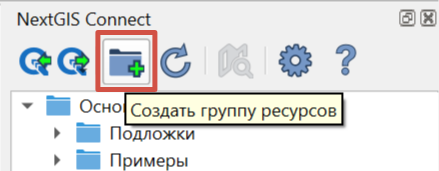

   Создание группы ресурсов

.. _web_map:

Создание веб-карты на основе слоя
----------------------------------

* Выберите в дереве ресурсов Веб ГИС в окне модуля NextGIS Connect векторный или растровый слой, который вы хотите представить на веб-карте;
* В контекстном меню выберите **Создать веб-карту**.

В той же группе ресурсов будет создана веб-карта с именем вида "имя_слоя-map". Для слоя будет создан стиль QGIS и добавлен на веб-карту. Начальный охват карты устанавливается по охвату слоя.

.. _new_vector_layer:

Создание пустого векторного слоя
-----------------------------------

При помощи модуля NextGIS Connect можно создавать в Веб ГИС новые векторные слои без данных.

Для этого выберите в панели Connect группу, внутри которой хотите создать слой. Затем в верхнем меню "Слой" выберите :menuselection:`Создать слой ‣ Новый векторный слой NextGIS Web`.

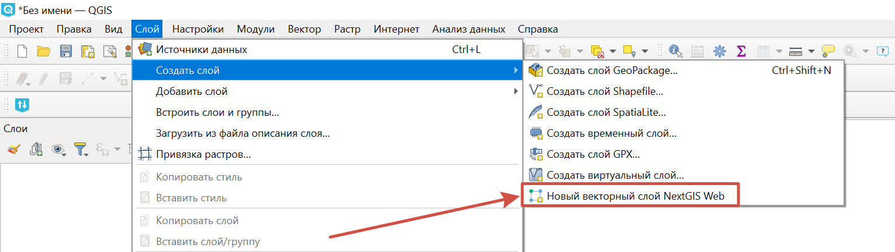

   Создание нового векторного слоя в Веб ГИС

Появится диалоговое окно, в котором нужно будет выбрать параметры создаваемого слоя:

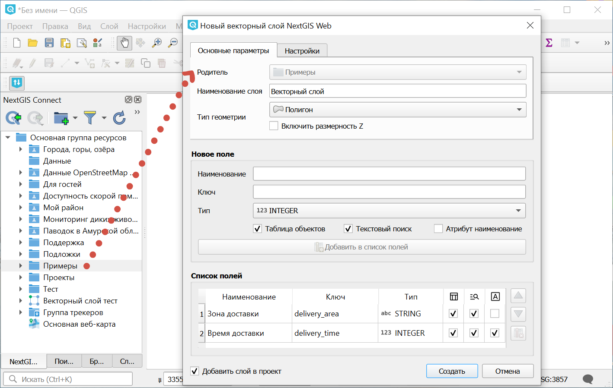

   Настройки создаваемого слоя

* Наименование слоя
* Тип геометрии
* Включение размерности Z
* Поля слоя: введите отображаемое наименование и ключ, выберите тип поля, затем нажмите **Добавить в список полей**. Для каждого поля можно указать параметры: 

   * Таблица объектов -  содержимое этого поля выводится в окне идентификации;
   * Текстовый поиск - включить/отключить поиск по значениям этого атрибута;
   * Атрибут наименование - значение из этого поля будет использоваться как название объекта на карте.

* Можно выбрать: добавить слой в проект QGIS или только создать его в Веб ГИС

Также в настройках создаваемого слоя можно сразу включить `версионирование <https://docs.nextgis.ru/docs_ngweb/source/version.html#vers-qgis>`_. Для этого перейдите во вторую вкладку в верхней части диалогового окна.

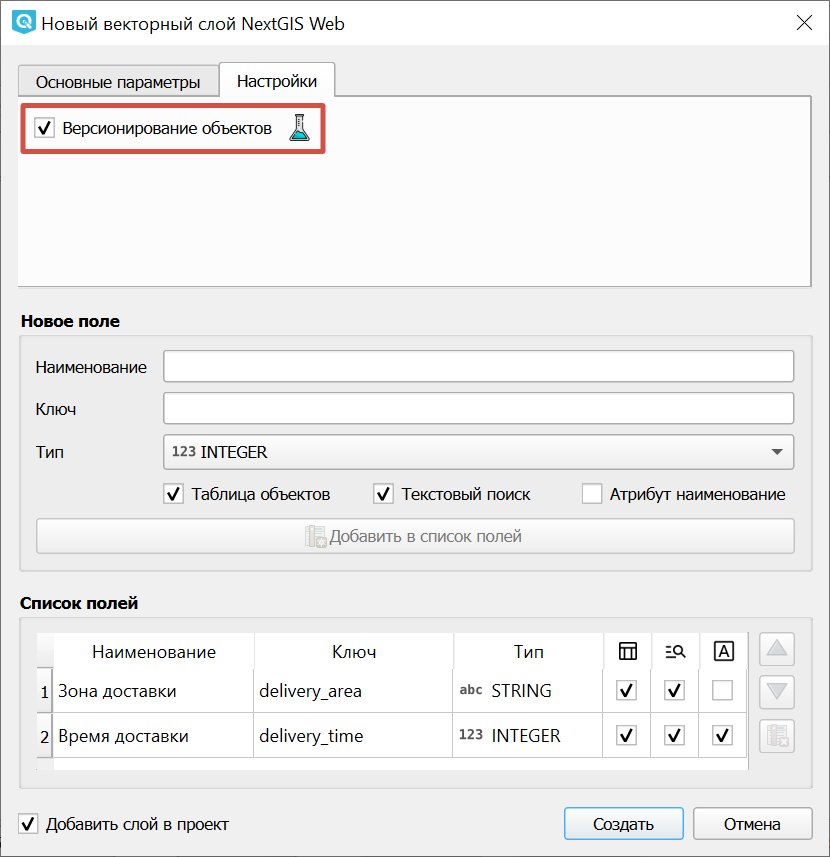

   Включение версионирования

Для завершения нажмите **Создать**.

Новый слой появится в дереве ресурсов в панели Connect и в панели слоёв QGIS, если была отмечена опция "Добавить в проект".

На плане Free в Веб ГИС может быть до 15 слоёв. Если вам нужно больше слоёв, `подключите подиску Premium в личном кабинете <https://my.nextgis.com/subscription/>`_.

.. _connect_services:

Создание Сервисов: WFS, WMS, OGC API - Features
-------------------------------------------------

Модуль NextGIS Connect позволяет быстро публиковать Векторные слои в Веб ГИС по стандартным протоколам :term:`WFS`, :term:`WMS` и OGC API - Features. Растровые слои так же можно публиковать по протоколу :term:`WMS`.

.. _create_wfs_service:

Создание сервиса WFS
~~~~~~~~~~~~~~~~~~~~~

Для этого в модуле доступна операция быстрого создания Сервиса WFS:

* В настольном приложении (QGIS) в дереве ресурсов Веб ГИС модуля NextGIS Connect выберите **Векторный слой**, который вы хотите опубликовать по протоколу WFS;

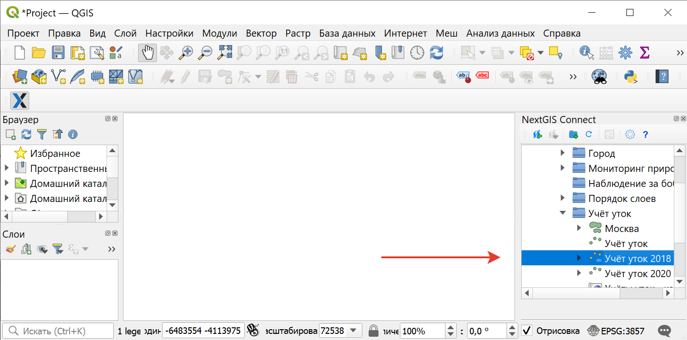
   
   Выбор слоя

* Выберите пункт **Создать сервис WFS** в контекстном меню слоя;

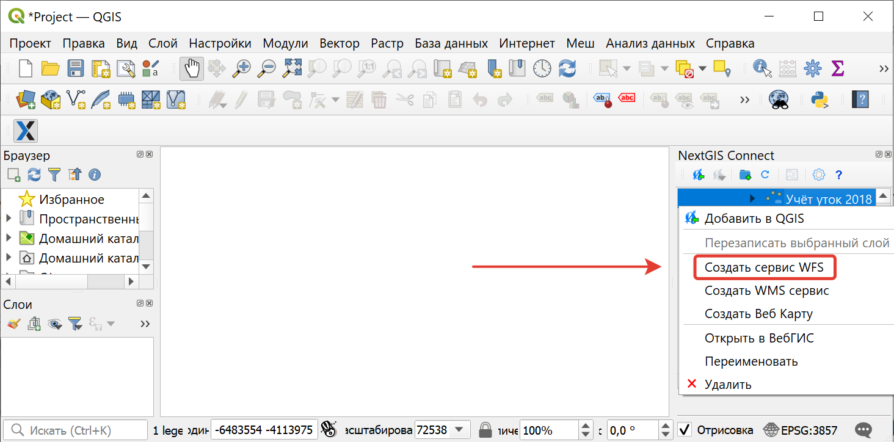
   
   Контекстное меню слоя
   
* В открывшемся диалоговом окне укажите число объектов слоя, которое должен публиковать Сервис WFS;

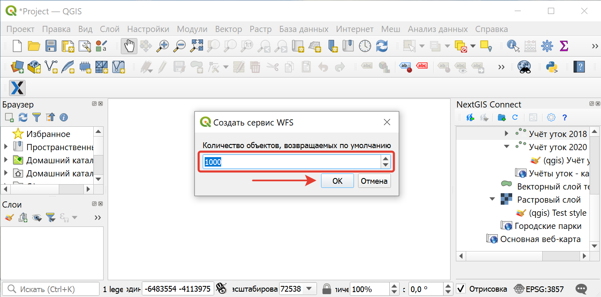
   
   Число публикуемых объектов слоя

* Если Сервис WFS создался успешно, то в соответствующей Группе ресурсов появится новый Сервис WFS, в который уже подключен ваш Векторный слой.

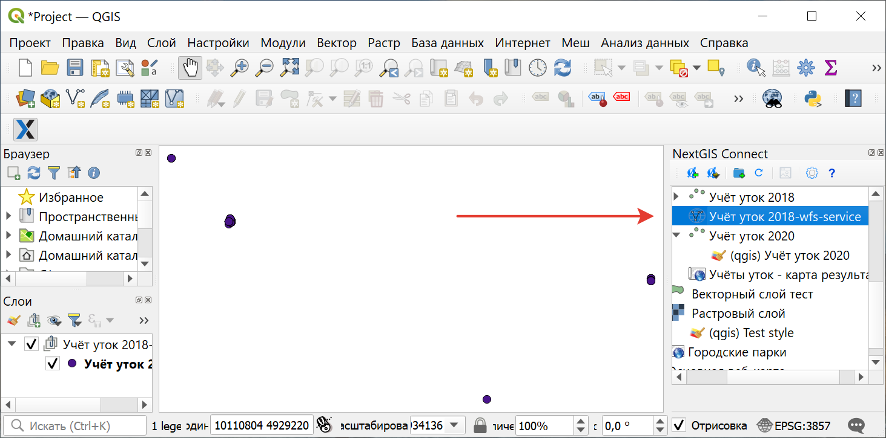
   
   Созданный сервис WFS в дереве ресурсов
   
.. note:: 
	Отредактировать настройки созданного таким образом Сервиса WFS (включая его название, публикуемые слои и их настройки) можно через веб-интерфейс Веб ГИС.

.. _create_ogc_api_feat_service:

Создание сервиса OGC API - Features
~~~~~~~~~~~~~~~~~~~~~~~~~~~~~~~~~~~~

Для этого в модуле доступна операция быстрого создания Сервиса OGC API - Features:

* В настольном приложении (QGIS) в дереве ресурсов Веб ГИС модуля NextGIS Connect выберите **Векторный слой**, который вы хотите опубликовать по протоколу OGC API - Features;

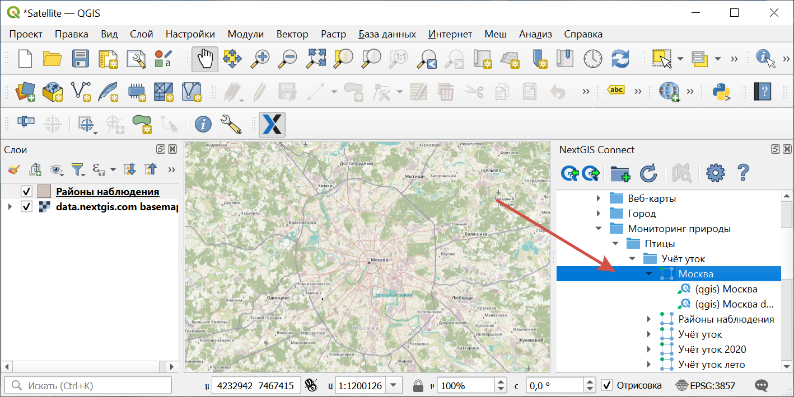
   
   Выбор слоя

* Выберите пункт **Создать сервис OGC API - Features** в контекстном меню слоя;

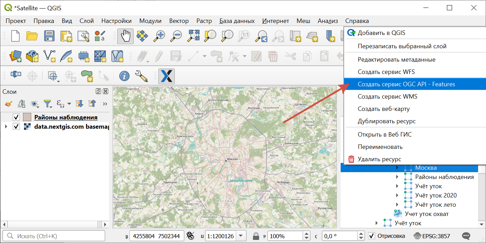
   
   Контекстное меню слоя
   
* В открывшемся диалоговом окне укажите число объектов слоя, которое должен публиковать Сервис OGC API - Features;

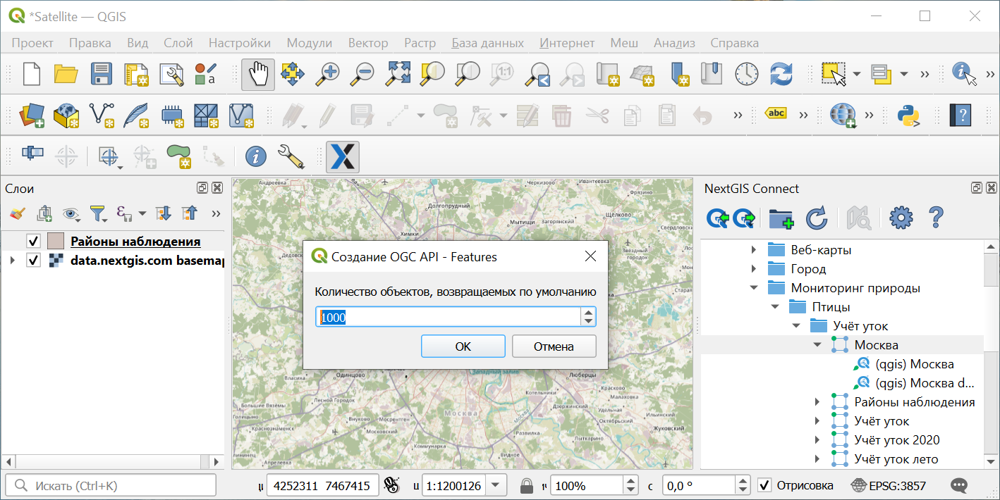
   
   Число публикуемых объектов слоя

* Если Сервис OGC API - Features создался успешно, то в соответствующей Группе ресурсов появится новый Сервис OGC API - Features, в который уже подключен ваш Векторный слой.

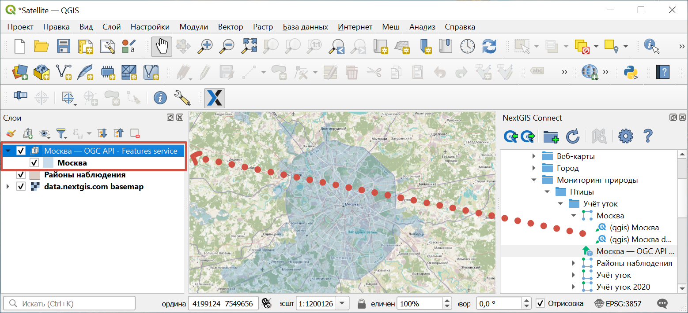
   
   Созданный сервис OGC API - Features в дереве ресурсов

.. _create_wms_service:

Создание сервиса WMS
~~~~~~~~~~~~~~~~~~~~~

Для этого в модуле доступна операция быстрого создания Сервиса WMS:

* В настольном приложении (QGIS) в дереве ресурсов Веб ГИС модуля NextGIS Connect выберите **Векторный слой**, **Растровый слой** или **Стиль QGIS** слоя, который вы хотите опубликовать по протоколу WMS;

   
   Выбор слоя
   
* Выберите пункт **Создать WMS сервис** в контекстном меню слоя;

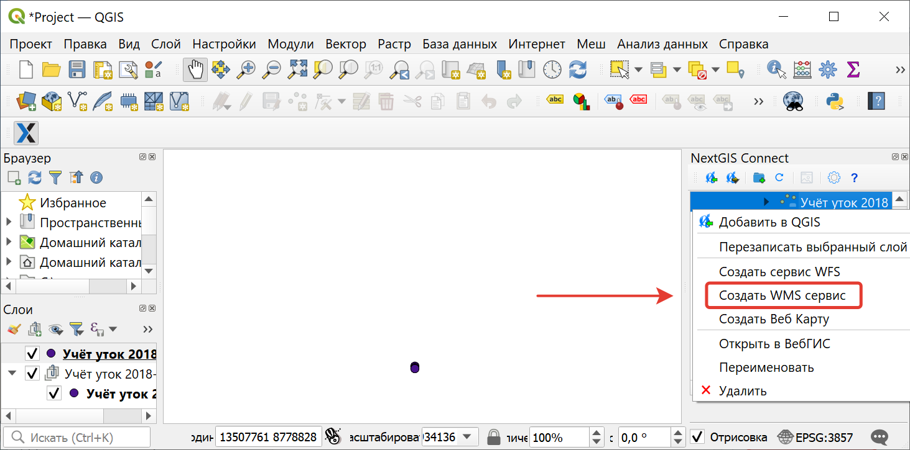
   
   Контекстное меню слоя
   
* В открывшемся диалоговом выберите стиль слоя для публикация Сервиса WMS;

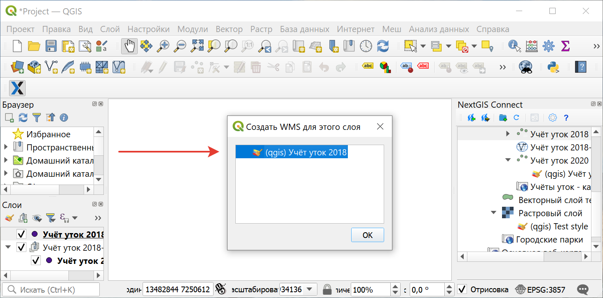
   
   Выбор стиля для публикации Сервиса WMS
   
* Если Сервис WMS создался успешно, то в соответствующей Группе ресурсов появится новый Сервис WMS, в который уже подключен ваш Векторный слой.

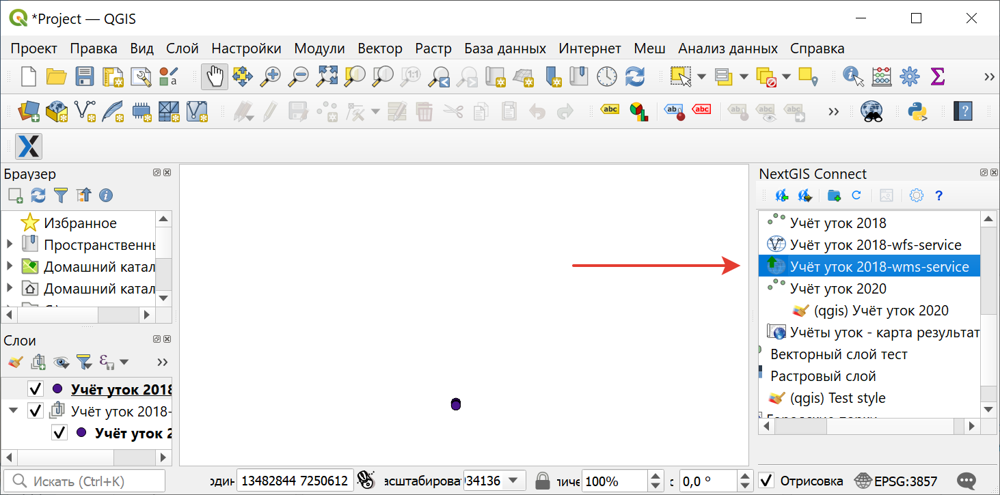
   
   Созданный Сервис WMS в дереве ресурсов

.. _connect_resource_double:

Дублирование ресурсов
-----------------------

При помощи модуля можно создать копию слоя в Веб ГИС. Доступно для ресурсов Векторный слой и Растровый слой. 

* Чтобы скопировать слой, выберите его в окне модуля Connect и в контекстном меню нажмите **Дублировать ресурс**.
* Во всплывающем окне подтвердите дублирование.

Копия слоя будет создана в той же папке, стиль слоя также будет скопирован.

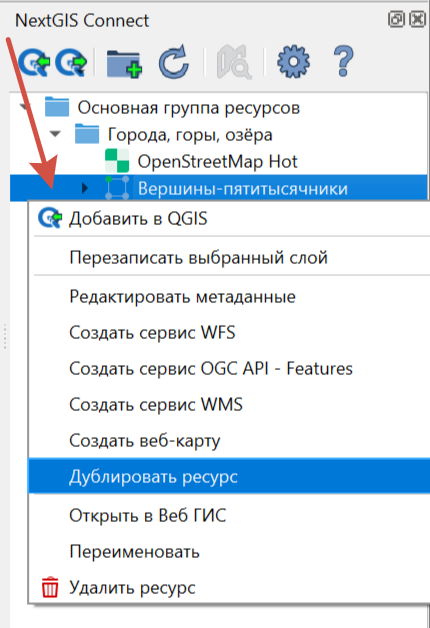

   Дублирование ресурса

.. _connect_resource_delete:

Удаление ресурсов
-------------------

Модуль NextGIS Connect позволяет быстро создавать / удалять любые ресурсы из Веб ГИС. Для этого:

* Выберите в дереве ресурсов Веб ГИС в окне модуля NextGIS Connect ресурс, который вы хотите удалить;
* Выберите пункт **Удалить** в контекстном меню;
* Если ресурс удалился успешно, то он исчезнет из дерева ресурсов Веб ГИС.