Manage resources
================

.. _ng_connect_res_group:

Create resource group
-------------------------

In the top menu of the NextGIS Connect plugin you'll find a "Create group" button.

A new group will be created:

* If a resource group is selected in the Connect panel - in that group;
* If other type of resources but a group is selected - in the closest parent group 

* If no resource is selected - in the main resource group.

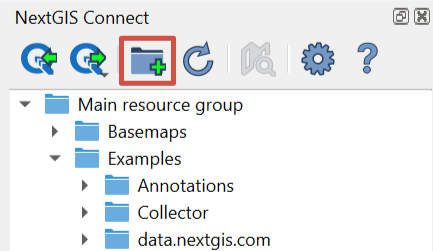

   Creating resource group

.. _web_map:

Create Web Map from a layer
----------------------------------

* In NextGIS Connect panel select from the resource tree the Vector layer which you want to display on a Web Map;
* In the layer's context menu select **Create Web Map**.

A Web Map with the name "layer_name-map" will be created in the same resource group. A QGIS style will be created for the layer and added to Web Map. The map's initial extent is set by the layer.

.. _new_vector_layer:

Create empty vector layer
-----------------------------------

With NextGIS Connect plugin you can create a new vector layer in your Web GIS without uploading data.

In the Connect panel select the resource group inside which you want to create a new layer. In the menu bar select :menuselection:`Layer ‣ Create layer ‣ New NextGIS Web vector layer`.

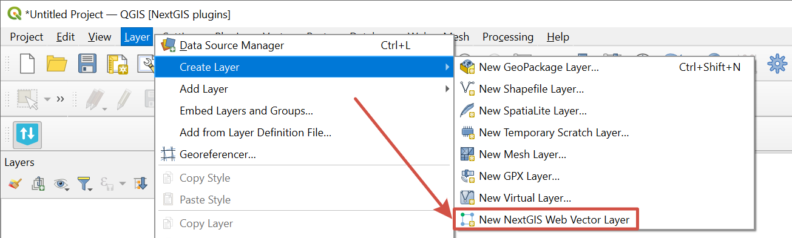

   Creating new vector layer in Web GIS

In the opened dialog enter the parameters of the new layer:

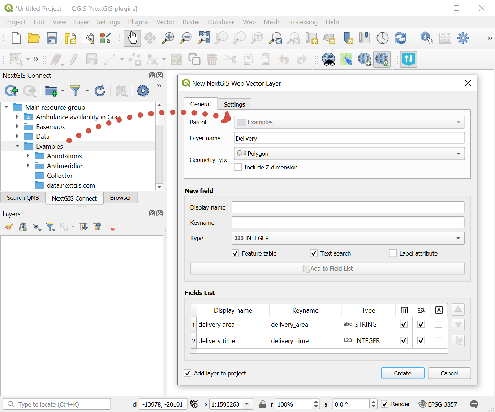

   Parameters of the new layer

* Layer name
* Geometry type
* Option to include Z dimension
* Layer fields: enter the display name and keyname, select field type, then press **Add to Field List**. Available field parameters: 

   * Feature table - the contents of the field will be displayed in the identification panel;
   * Text search - enable/disable text search in the values of the attribute;
   * Label attribute - values from this field will be used as feature labels on the map.

* You can also choose to add the layer to the project or just create in in the Web GIS.

Also while creating a layer you can turn on `versioning <https://docs.nextgis.com/docs_ngweb/source/version.html#vers-qgis>`_ for it. Go to the second tab, "Settings".

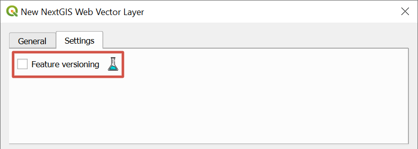

   Enable versioning

To complete the process, pess **Create**.

The new layer will appear in the resource tree of the Connect panel as well as the QGIS Layers panel if the "Add layer to project" option was ticked.

On Free plan you can create up to 15 layers. If you need more, you can `upgrade to Premium <https://my.nextgis.com/subscription/>`_ in your NextGIS ID account.

.. _connect_services:

Create service
----------------

NextGIS Connect plugin allows to quickly publish vector data using standard protocols :term:`WFS`, :term:`WMS` and OGC. Raster data can also be published using :term:`WMS`.

.. _create_wfs_service:

Create WFS service
~~~~~~~~~~~~~~~~~~~~~

It's possible due to the quick creation of :ref:`WFS service <ngcom_wfs_service>` option in NextGIS Connect: 

* Select in NextGIS Connect Resources panel Vector layer which you want to publish using WFS protocol;

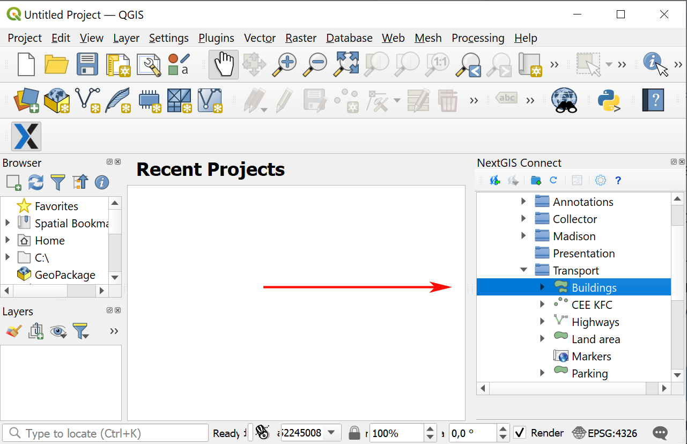
   
   Selecting vector layer

* Select **Create WFS service** in layer context menu;

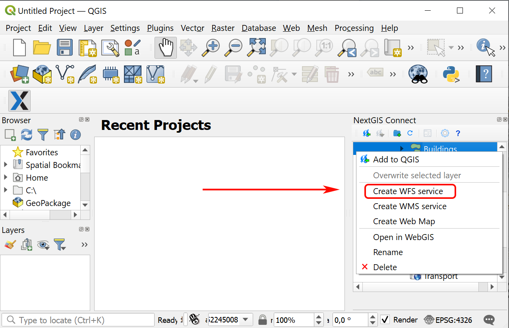
   
   Selecting "Create WFS service" in the Vector layer context menu
   
* In the opened dialog window set the number of layer's features to be published via WFS service by changing the value of the field **The number of objects returned by default**;

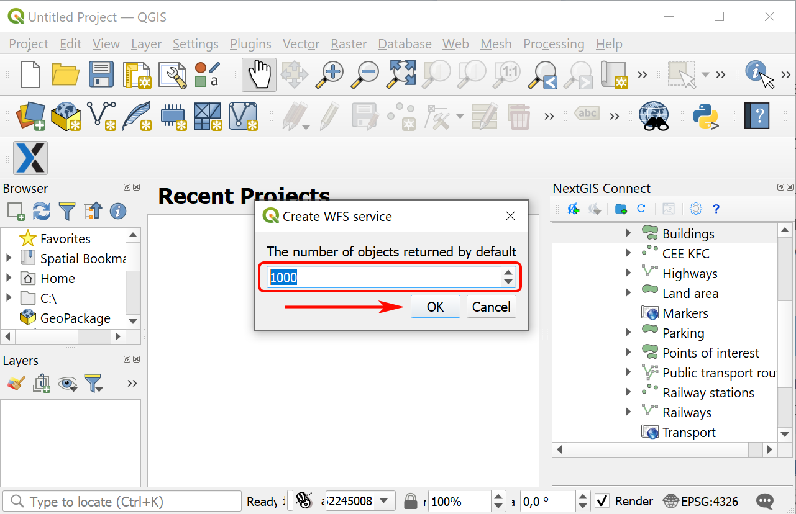
   
   Number of features returned by default

* If WFS service is created successfully you'll see it in the relevant Resource group. The Vector layer is already connected to it.

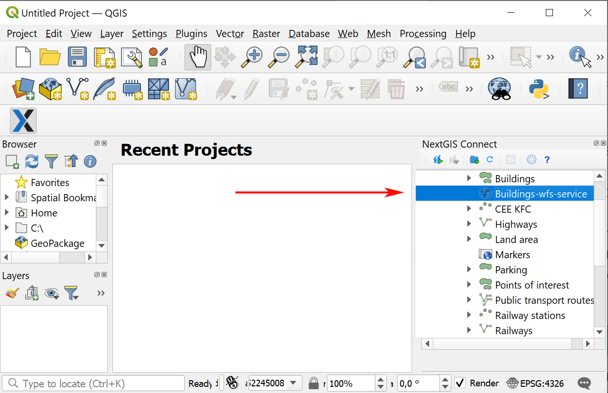
   
   Newly created WFS service
   
.. note:: 
	You can edit the settings of WFS service (including its name, published layers and their settings) in the user interface of your Web GIS.

.. _create_ogc_api_feat_service:

Create OGC API - Features service
~~~~~~~~~~~~~~~~~~~~~~~~~~~~~~~~~~~~

NextGIS Connect plugin enables a fast publication of Vector layers from your Web GIS using standard OGC API - Features protocol.

* Select in NextGIS Connect Resources panel a **Vector layer** from your Web GIS resource tree which you want to publish using OGCF protocol;

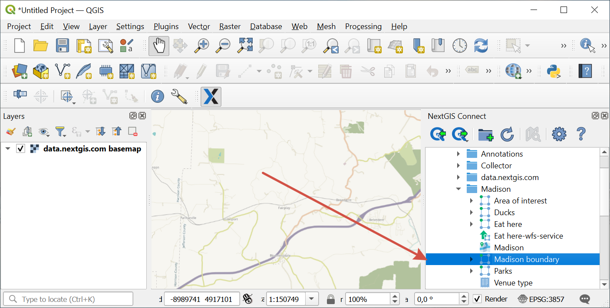
   
   Selecting vector layer

* Select **Create OGC API - Features service** in layer context menu;

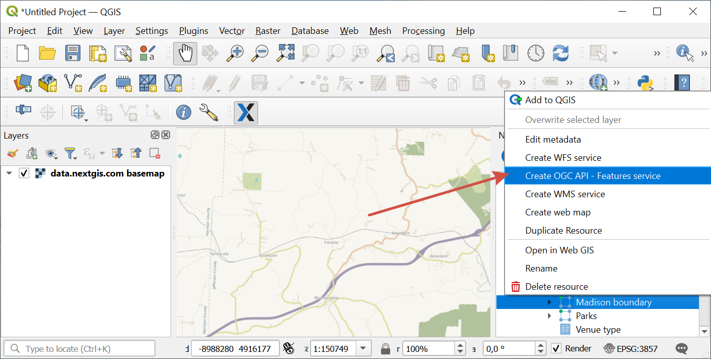
   
   Selecting "Create OGC API - Features service" in the Vector layer context menu
   
* In the opened dialog window set the number of layer's features to be published via OGCF service by changing the value of the field **The number of objects returned by default**;

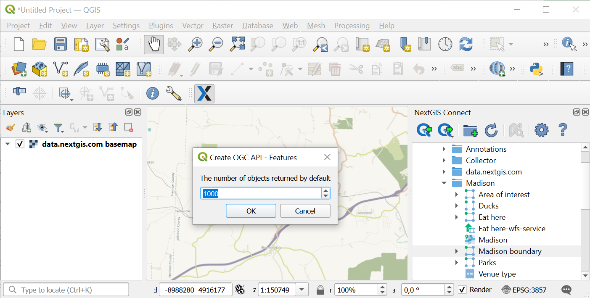
   
   Number of features returned by default

* If OGCF service is created successfully you'll see it in the relevant Resource group. The Vector layer is already connected to it.

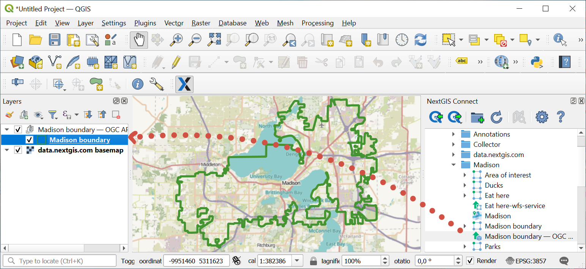
   
   Newly created OGC API - Features service

.. _create_wms_service:

Create WMS service
~~~~~~~~~~~~~~~~~~~~~

The process is similar to creation of WFS service (see above):

* In the desktop application (QGIS) in the resource Web GIS tree of module NextGIS Connect select **Vector layer**, **Raster layer** or **QGIS style** that you want to publish via the WMS protocol; 

   
   Selecting vector layer
   
* Select **Create WMS Service** in the context menu of the layer;

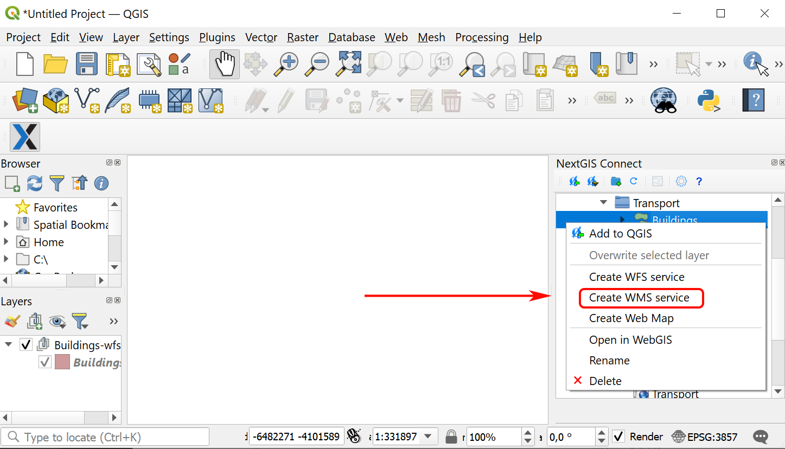
   
   Selecting "Create OGC API - Features service" in the Vector layer context menu
   
* In the dialog that opens select a layer style for publishing the WMS Service;

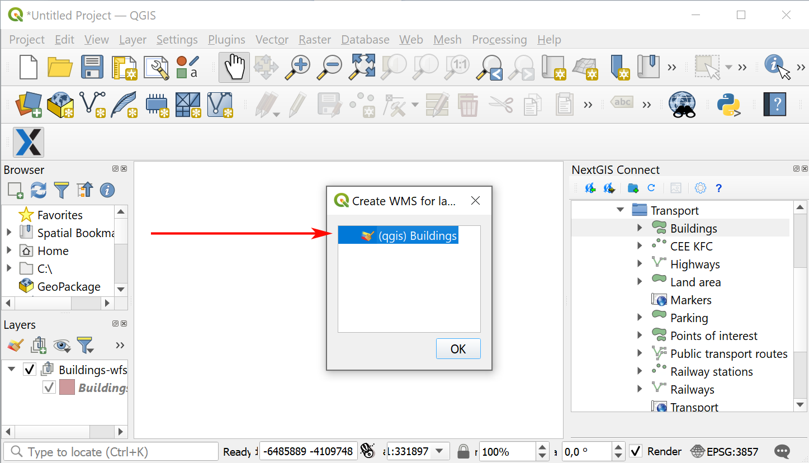
   
   Selecting layer style
   
* If the WMS Service has been created successfully, then a new WMS Service will appear in the corresponding Resource Group, to which your Vector Layer is already connected. 

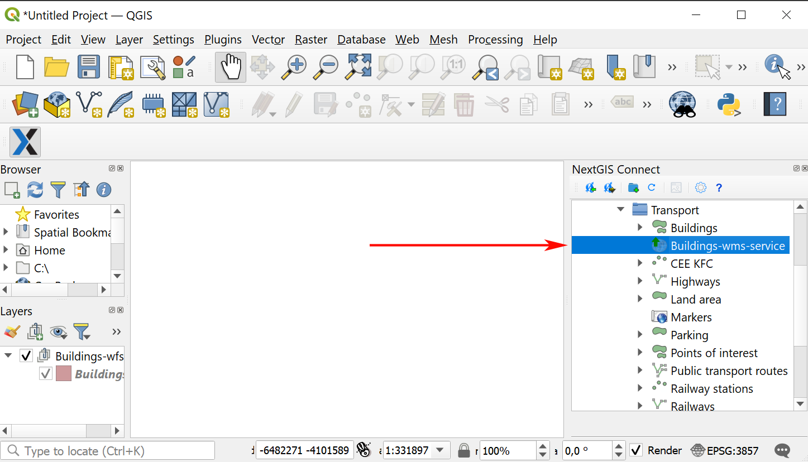
   
   Newly created WMS service

.. _connect_resource_double:

Duplicate resource
-----------------------

With NG Connect you can copy an existing Web GIS layer. This option is available for Vector and Raster layers. 

* To make a copy of a layer, select it in the Connect panel, then in the context menu click **Duplicate resource**.
* In the pop-up window confirm copying.

Copy will be created in the same group. The layer's style will also be duplicated.

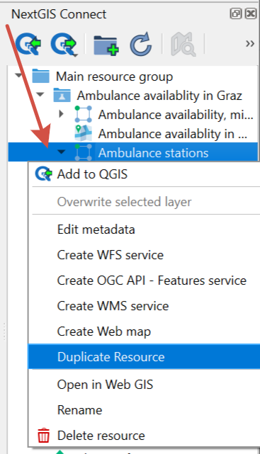

   Duplicating resource

.. _connect_resource_delete:

Delete resource
-------------------

With NextGIS Connect you can quickly create and delete any resource in your Web GIS. 

* In the NextGIS Connect panel select the resource you wish to delete;
* In the context menu select **Delete**;
* If the resource is deleted successfully, it disappears from the Web GIS layer tree.
 