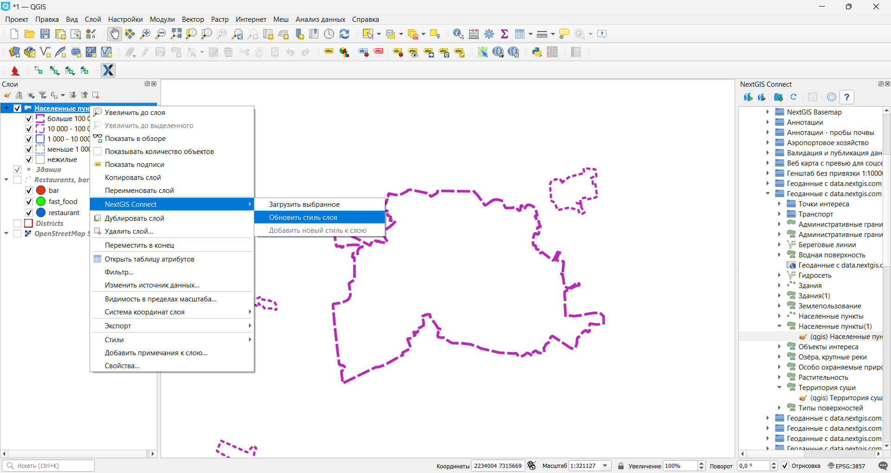

.. _ng_connect_data_transfer:

Обмен данными
==============

Модуль NextGIS Connect позволяет обмениваться геоданными между QGIS и Веб ГИС в обоих направлениях, но со своими особенностями.

.. _ng_connect_types:

Типы ресурсов 
--------------

Для обмена данными и работы доступны следующие типы ресурсов:

.. |resource_vector_point| image:: _static/nextgis_connect/vector_layer_point.png
.. |resource_vector_mpoint| image:: _static/nextgis_connect/vector_layer_mpoint.png
.. |resource_vector_line| image:: _static/nextgis_connect/vector_layer_line.png
.. |resource_vector_mline| image:: _static/nextgis_connect/vector_layer_mline.png
.. |resource_vector_polygon| image:: _static/nextgis_connect/vector_layer_polygon.png
.. |resource_vector_mpolygon| image:: _static/nextgis_connect/vector_layer_mpolygon.png
.. |resource_wfs| image:: _static/nextgis_connect/resource_wfs_symbol.png
.. |resource_wms| image:: _static/nextgis_connect/resource_wms_symbol.png
.. |resource_style| image:: _static/nextgis_connect/resource_style_symbol.png
.. |resource_webmap| image:: _static/nextgis_connect/resource_webmap_symbol.png
.. |resource_group| image:: _static/nextgis_connect/resource_group.png
.. |raster_layer| image:: _static/nextgis_connect/raster_layer.png
.. |vector_layer| image:: _static/nextgis_connect/vector_layer_symbol.png
.. |basemap_symbol| image:: _static/nextgis_connect/basemap_symbol.png
.. |tms_service_symbol| image:: _static/nextgis_connect/tms_service_symbol.png
.. |tms_connection_symbol| image:: _static/nextgis_connect/tms_connection_symbol.png
.. |postgis_layer_symbol| image:: _static/nextgis_connect/postgis_layer_symbol.png
.. |demo_project_symbol| image:: _static/nextgis_connect/demo_project_symbol.png
.. |wms_layer_symbol| image:: _static/nextgis_connect/wms_layer_symbol.png
.. |wms_connection_symbol| image:: _static/nextgis_connect/wms_connection_symbol.png
.. |wfs_layer_symbol| image:: _static/nextgis_connect/wfs_layer_symbol.png

- |vector_layer| - Векторный слой (NGW Vector Layer), он может быть: 
  |resource_vector_point| Точечный; 
  |resource_vector_mpoint| Мультиточечный; 
  |resource_vector_line| Линейный; 
  |resource_vector_line| Мультилинейный; 
  |resource_vector_polygon| Полигональный; 
  |resource_vector_mpolygon| Мультиполигональный; 

- |resource_style| - Стиль векторного слоя.
- |resource_wfs| - WFS Сервис (NGW WFS Service)
- |resource_wms| - WMS Сервис (NGW WMS Service)
- |tms_service_symbol| - Слой TMS
- |postgis_layer_symbol| - Слой PostGIS
- |wfs_layer_symbol| - Слой WFS
- |raster_layer| - Растровый слой (NGW Raster Layer)
- |basemap_symbol| - Подложка
- |resource_webmap| - Веб карта (NGW Web Map)
- |resource_group| - Группа ресурсов

.. _ng_connect_import:

Загрузка данных из QGIS в Веб ГИС
----------------------------------

Модуль NextGIS Connect позволяет загружать в Веб ГИС:

1. Векторные данные
2. Растровые данные
3. Базовые карты (подложки)
4. Группы слоёв
5. Проект QGIS целиком

Также модуль позволяет опубликовать векторные данные по стандартным протоколам :term:`WFS`, :term:`WMS` и OGC API - Features.

Алгоритм загрузки каждого типа данных описан `здесь <https://docs.nextgis.ru/docs_ngconnect/source/resources.html>`_.

.. figure:: _static/nextgis_connect/add_to_ngw_ru.png
   :align: center
   :width: 10cm
   
   Меню загрузки данных в Веб ГИС в панели NG Connect

Также загрузку данных в Веб ГИС можно выбрать как один из способов экспорта слоя, группы слоёв или проекта целиком.

.. figure:: _static/nextgis_connect/context_export_to_ngw_ru.png
   :align: center
   :width: 20cm

   Загрузка данных в Веб ГИС через контекстное меню панели слоёв

- Векторный слой - в Веб ГИС будет создан векторный слой и стиль, аналогичный стилю 
  выбранного слоя в QGIS, который можно добавить на веб-карту в Веб ГИС.
- Растровый слой - в Веб ГИС будет создан растровый слой со стилем по умолчанию, 
  который можно добавить на веб-карту в Веб ГИС.
- Загрузить всё - В Веб ГИС будут добавлены все слои, для которых доступна операция "Импортировать выбранный слой", и все группы в соответствии с иерархией в панели слоёв QGIS. Также будет создана веб-карта, на которую будут добавлены все импортируемые слои с учетом иерархии и видимости в панели слоёв QGIS. Вам необходимо ввести название новой группы, которая будет создана в Веб ГИС для размещения всех ресурсов, импортируемых в рамках данной операции. После импорта проекта созданная веб-карта откроется в браузере автоматически, если в настройках модуля выбрана соответствуюйщая опция.
- Обновить стиль слоя - В Веб ГИС будет обновлен стиль слоя аналогично стилю выбранного слоя в QGIS.
- Добавить новый стиль к слою - В Веб ГИС будет добавлен новый стиль к слою, аналогично стилю выбранного слоя в QGIS.

При загрузке слоя с **несколькими стилями** в NGW, они загружаются со своими именами. Если название стиля - default (или "по умолчанию"), используется название слоя. 

Добавление ресурсов в Веб ГИС производится в выбранную на панели ресурсов Веб ГИС группу.

- Если выбрана не группа, а другой тип ресурса - в ближайшую родительскую группу выбранного ресурса.
- Если не выбран ресурс - в корневую группу.

Также поддерживается выгрузка в Веб ГИС вложений. Посмотрите, как это работает, в видео:

.. raw:: html

   <iframe width="560" height="315" src="https://rutube.ru/play/embed/4a8748602408662ce01012be6ed9ae51/" frameBorder="0" allow="clipboard-write; autoplay" webkitAllowFullScreen mozallowfullscreen allowFullScreen></iframe>

Посмотреть видео на `youtube <https://youtu.be/K9S8TPLYC9w>`_, `rutube <https://rutube.ru/video/4a8748602408662ce01012be6ed9ae51/>`_.

.. warning::

   Стоит обратить внимание на то, что **фотографии**, которые были собраны в мобильных приложениях NextGIS Collector/Mobile и загружены в Веб ГИС вместе со слоями в виде вложений, **не будут** доступны в настольной NextGIS QGIS после загрузки этих слоев через модуль NextGIS Connect!

.. _qgis_project:

Загрузка проекта QGIS целиком
-------------------------------

* Соберите в QGIS проект из растровых и векторных слоев. Настройте их стили отображения, иерархию, группировку, видимость. Настройте охват карты;
* Выберите в дереве ресурсов Веб ГИС в окне модуля NextGIS Connect Группу ресурсов, в которую вы хотите загрузить проект;
* Нажмите кнопку **Загрузить всё** на панели инструментов модуля;

.. figure:: _static/NGConnect_import_menu_ru_2.png
   :name: NGConnect_import_menu_pic
   :align: center
   :width: 20cm
   
   Импорт текущего проекта
   
* В открывшемся диалоговом окне укажите название новой Группы ресурсов, в которую будет загружен проект;

.. figure:: _static/NGConnect_import_name_ru_2.png
   :name: NGConnect_import_name_pic
   :align: center
   :width: 20cm
   
   Указание имени импортируемого проекта

* Если проект загрузился успешно, то в соответствующей Группе ресурсов появится новая Группа ресурсов с заданным названием, внутри которой будут находиться: 

1) все Растровые и Векторные слои, для которых доступна операция *Добавить в Веб ГИС*, а также их Стили;
2) автоматически созданная `Веб-карта <https://docs.nextgis.ru/docs_ngweb/source/webmaps_client.html#ngw-webmaps-client>`_ с заданным охватом, на которую будут добавлены все импортированные слои с учетом их группировки, иерархии и видимости в панели слоёв QGIS.

.. note:: 
	Быстро перейти к Веб-карте можно, нажав кнопку **Открыть карту в браузере** на панели инструментов модуля или выбрав соответствующую команду в контекстном меню Веб-карты.

.. figure:: _static/NGConnect_import_view_ru_2.png
   :name: NGConnect_import_view_pic
   :align: center
   :width: 20cm
   
   Открытие импортированного проекта в Веб ГИС через контекстное меню

При добавлении группы ресурсов, которая содержит слои **с несколькими стилями**, будут добавлены все стили и выбран в качестве текущего либо одноименный слою, либо первый по алфавиту. Диалог с выбором показан не будет.

.. raw:: html

   <iframe width="560" height="315" src="https://rutube.ru/play/embed/f374bd300335a78dddd017a0c0934eec/" frameBorder="0" allow="clipboard-write; autoplay" webkitAllowFullScreen mozallowfullscreen allowFullScreen></iframe>

Смотреть на `youtube <https://youtu.be/qIByQEqZ4oQ>`__, `rutube <https://rutube.ru/video/f374bd300335a78dddd017a0c0934eec/>`__.

.. _vector_data:

Загрузка векторных данных
------------------------------

.. important:: 
   Вы можете избежать `ограничений по форматам данных <https://docs.nextgis.ru/docs_ngweb/source/layers.html#ngw-vector-data-requirements>`_ при загрузке векторных данных в Веб ГИС через NextGIS Connect, применив опции "Переименовывать запрещенные поля" и "Исправлять некорректные геометрии" в диалоге :guilabel:`Настройки`.

* Создайте в QGIS "с нуля" или добавьте из файлов векторные слои :term:`ESRI Shape`, :term:`GeoJSON` или :term:`CSV`. Настройте стили их отображения;
* Выберите в дереве ресурсов Веб ГИС в окне модуля NextGIS Connect Группу ресурсов, в которую вы хотите загрузить данные (или создайте её с помощью кнопки "`Создать новую группу ресурсов <https://docs.nextgis.ru/docs_ngconnect/source/ngc_data_transfer.html#ng-connect-res-group>`_");
* Выберите в панели слоев QGIS векторный слой, который вы хотите загрузить в Веб ГИС;
* Нажмите кнопку **Добавить в Веб ГИС** на панели инструментов модуля и кликните **Загрузить выбранное** в меню или нажмите **NextGIS Connect --> Загрузить выбранное** в контекстном меню слоя;
* Если данные загрузились успешно, то в соответствующей Группе ресурсов появится новый Векторный слой, внутри которого будет создан `Стиль QGIS <https://docs.nextgis.ru/docs_ngweb/source/mapstyles.html>`_ с заданными настройками стиля.

При загрузке слоя **с несколькими стилями** в Веб ГИС, они загружаются со своими именами. Если название стиля - default (или "по умолчанию"), используется название слоя. 

.. _raster_data:

Загрузка растровых данных
----------------------------

* Добавьте в QGIS из файлов растровые слои :term:`GeoTIFF`;

.. note:: Если растровый файл сохранён в другом формате, например, PostGIS, то при загрузке он будет преобразован в GeoTIFF с проекцией EPSG:3857.

* Выберите в дереве ресурсов Веб ГИС в окне модуля NextGIS Connect Группу ресурсов, в которую вы хотите загрузить данные;
* Выберите в панели слоев QGIS растровый слой, который вы хотите загрузить в Веб ГИС;
* Нажмите кнопку **Добавить в Веб ГИС** на панели инструментов модуля и кликните **Загрузить выбранное** в меню или нажмите **NextGIS Connect --> Загрузить выбранное** в контекстном меню слоя;
* Если данные загрузились успешно, то в соответствующей Группе ресурсов появится новый Растровый слой , внутри которого будет создан `Растровый стиль <https://docs.nextgis.ru/docs_ngweb/source/mapstyles.html#ngw-process-create-raster-style>`_ с настройками стиля по умолчанию.

Посмотрите, как это работает, в видео:

.. raw:: html

   <iframe width="560" height="315" src="https://rutube.ru/play/embed/be92d2c9959a434d09f41ec1e715b276/" frameBorder="0" allow="clipboard-write; autoplay" webkitAllowFullScreen mozallowfullscreen allowFullScreen></iframe>

Посмотреть видео на `youtube <https://youtu.be/b2CudmkYUOQ>`_, `rutube <https://rutube.ru/video/be92d2c9959a434d09f41ec1e715b276/>`_.

.. _basemaps:

Загрузка базовых карт (подложек)
---------------------------------

* Добавьте в QGIS базовую карту (подложку);
* Выберите в дереве ресурсов Веб ГИС в окне модуля NextGIS Connect Группу ресурсов, в которую вы хотите добавить подложку;
* Выберите в панели слоев QGIS подложку, которую вы хотите загрузить в Веб ГИС;
* Нажмите кнопку **Добавить в Веб ГИС** на панели инструментов модуля и кликните **Загрузить выбранное** в меню или нажмите **NextGIS Connect --> Загрузить выбранное** в контекстном меню слоя;
* Если подложка загрузилась успешно, то она появится в соответствующей Группе ресурсов.

Для работы с подложками ваша Веб ГИС должна быть на плане `Мини или Премиум <https://nextgis.ru/pricing-base/>`_, в противном случае вы не сможете импортировать их в Веб ГИС.

.. ng_connect_keep_photo:

Как сохранить вложения
~~~~~~~~~~~~~~~~~~~~~~~

Пользователь может столкнуться с задачей, когда нужно изменить стилевые настройки слоя, **не потеряв при этом фотографии**. 

Порядок действий в данном случае следующий:

1. Добавить стиль слоя через NextGIS Connect из Веб ГИС в QGIS.
2. Внести необходимые изменения в стиль.
3. Обновить стиль слоя через NextGIS Connect.

   
   Обновление стиля

.. _ng_connect_export:

Загрузка данных из Веб ГИС в QGIS
---------------------------------

.. figure:: _static/nextgis_connect/add_to_qgis_ru.png
   :align: center
   :alt: Добавить в QGIS
   :width: 10cm
   
   Кнопка экспорта данных в QGIS

Операция доступна, если в дереве ресурсов NextGIS выбран один из следующих видов ресурсов:

- Векторный слой (NGW Vector Layer) |vector_layer| - в QGIS будет создан векторный 
  слой GeoJSON;
- WFS Слой |wfs_layer_symbol| - в QGIS будет создан WFS слой;
- WFS Сервис (NGW WFS Service) |resource_wfs| - в QGIS будет создан WFS слой, источником 
  данных для которого будет выбранный WFS Сервис;
- WMS Слой |wms_layer_symbol| - в QGIS будет добавлен выбранный WMS слой;
- WMS Сервис |resource_wms| - в QGIS будет создан WMS слой, источником данных для которого будет выбранный WMS Сервис;
- WMS Соединение |wms_connection_symbol| - из списка можно будет выбрать WMS слой, который необходимо добавить в QGIS
- TMS Слой |tms_service_symbol|;
- TMS Соединение |tms_connection_symbol|;
- PostGIS Слой |postgis_layer_symbol|;
- QGIS Стиль Векторного слоя |resource_style| - если стиль относится к векторному слою, в QGIS будет создан векторный слой GeoJSON, со стилем идентичным выбранному стилю; если стиль относится к слою WFS, будет создан слой WFS с таким стилем;
- Растровый слой |raster_layer| - в QGIS будет создан растровый слой GeoTIFF;
- Подложка |basemap_symbol|;
- Веб-карта |resource_webmap| - при добавлении в QGIS она будет представлена в виде проекта со слоями, стилями и подложками. Подложки карты будут объединены во взаимоисключающую группу;
- `Демо-проект <https://docs.nextgis.ru/docs_ngcom/source/demoprojects.html>`_ |demo_project_symbol| - в QGIS будет создан проект, содержащий слои, стили и подложки;
- Группа ресурсов |resource_group| - в текущий проект QGIS будет добавлена новая группа и входящие в неё ресурсы.

Особенности загрузки слоев с **несколькими стилями**:

* При выборе в дереве Connect слоя с несколькими стилями, они подгрузятся все, но будет предложено выбрать текущий.
* При выборе в дереве Connect стиля слоя, добавятся все стили, по умолчанию будет выбранный.
* При добавлении группы ресурсов, которая содержит слои с несколькими стилями, будут добавлены все стили и выбран либо одноименный слою, либо первый по алфавиту. Диалог с выбором показан не будет.
* При добавлении WFS/OGCF стиль будет выбран либо одноименный слою, либо первый по алфавиту.

Процесс добавления слоя с несколькими стилями в видео:

.. raw:: html

   <iframe width="560" height="315" src="https://rutube.ru/play/embed/d65766eacd8a3f162fff6ce09556045b/" frameBorder="0" allow="clipboard-write; autoplay" webkitAllowFullScreen mozallowfullscreen allowFullScreen></iframe>

Смотреть на `youtube <https://youtu.be/snq2yv8iNEk>`__, `rutube <https://rutube.ru/video/d65766eacd8a3f162fff6ce09556045b/>`__.

Алгоритм загрузки разных типов данных в QGIS подробно описан `здесь <https://docs.nextgis.ru/docs_ngconnect/source/resources.html#connect-data-export>`__.

Векторные слои из вашей Веб ГИС можно `редактировать <https://docs.nextgis.ru/docs_ngconnect/source/edit.html#>`_ сразу после добавления их в QGIS.

.. _ng_connect_share_project:

Открытие проекта, созданного на другой машине
-------------------------------------------------

Начиная с версии модуля 3.2.0 если на двух компьютерах настроено подключение к одной Веб ГИС, можно передавать проекты, использующие откреплённые слои. При открытии данные сами подтянутся.

#. В NextGIS Connect проверьте наличие подключения к Веб ГИС и при необходимости создайте его. 
#. Добавьте нужные слои из Веб ГИС в проект QGIS.
#. Сохраните проект.
#. Скопируйте файл проекта и перенесите его на второе устройство.
#. На втором устройстве в NextGIS Connect проверьте наличие подключения к той же Веб ГИС и при необходимости создайте его.
#. Откройте проект.

Данные будут подгружены. Чтобы проверить успешность синхронизации, нажмите на значок статуса слоя рядом с его названием.

.. note:: Открывайте проект **после** того, как установили подключение. Если возникает ошибка "Недостающие слои", закройте проект, проверьте подключение к Веб ГИС и откройте проект снова.

.. _ng_connect_cont_menu:

Контекстное меню
----------------
Контекстное меню может отличаться у различных ресурсов. 

.. figure:: _static/nextgis_connect/context_menu_ru.png
   :align: center
   :alt: Контекстное меню qgis стиля векторного слоя
   :width: 10cm
   
   Пример контекстного меню

Общедоступные операции для всех типов ресурсов:

- Открыть в ВебГИС - открывает страницу выбранного ресурса в Веб ГИС, см. :numref:`ngc_open_from_layertree_pic`;

- Переименовать ресурс;

- `Удалить ресурс <https://docs.nextgis.ru/docs_ngconnect/source/ngc_data_transfer.html#connect-resource-delete>`_;

- Редактировать метаданные.

Опциональные - зависят от типа ресурса:

- Добавить в QGIS - операция и список ресурсов, для которых она доступна, описаны `выше <https://docs.nextgis.ru/docs_ngconnect/source/ngc_data_transfer.html#ng-connect-export>`_;

- `Создать Веб Карту <https://docs.nextgis.ru/docs_ngconnect/source/resources.html#web-map>`_ - доступен для ресурсов: Векторный слой, Стиль Векторного слоя, Растровый слой, слой WMS;

- `Загрузить как QML <https://docs.nextgis.ru/docs_ngconnect/source/export.html#connect-save-style>`_ - доступен только для ресурса QGIS Стиль Векторного слоя;

- `Копировать стиль <https://docs.nextgis.ru/docs_ngconnect/source/edit.html#connect-style-copy>`_  - доступен только для ресурса QGIS Стиль Векторного слоя;

- `Создать сервис WFS <https://docs.nextgis.ru/docs_ngconnect/source/resources.html#wfs>`_ - доступен только для ресурса Векторный слой;

- `Создать сервис OGC API - Features <https://docs.nextgis.ru/docs_ngconnect/source/resources.html#ogc-api-features>`_ - доступен только для ресурса Векторный слой;

- `Создать сервис WMS <https://docs.nextgis.ru/docs_ngconnect/source/resources.html#wms>`_ - доступен только для ресурса Векторный слой;

- `Дублировать ресурс <https://docs.nextgis.ru/docs_ngconnect/source/ngc_data_transfer.html#connect-resource-double>`_ - доступен только для ресурсов: Векторный слой и Растровый слой;

- `Перезаписать выбранный слой <https://docs.nextgis.ru/docs_ngconnect/source/edit.html#connect-data-overwrite>`_ - доступен только для ресурса Векторный слой;

- Просмотр в браузере - доступен для веб-карт, слоёв и стилей, в браузере откроется веб-клиент с картой или страница превью слоя/стиля соответственно.

Кроме того, при установке модуля появляется возможность переходить к данным в Веб ГИС из панели слоев в QGIS: в контекстном меню слоя в QGIS найдите «NextGIS Connect», и нажмите «Открыть в Веб ГИС».

.. figure:: _static/nextgis_connect/ngc_open_from_layertree_ru.png
   :align: center
   :alt: Контекстное меню в дереве слоев
   :name: ngc_open_from_layertree_pic
   :width: 22cm

   Открытие данных в Веб ГИС из дерева слоев QGIS

 

.. _connect_refresh:

Обновить
----------

Эта операция доступна в верхнем меню модуля NextGIS Connect.

Операция обновит все дерево ресурсов Веб ГИС до актуального на текущий момент состояния.

.. figure:: _static/nextgis_connect/reload_ru.png
   :align: center
   :alt: Обновить дерево ресурсов
   :width: 10cm

   Актуализация данных Веб ГИС

.. _connect_open_webmap:

Просмотр в браузере
-----------------------------

Эта операция доступна в верхнем меню модуля NextGIS Connect.

Если в дереве ресурсов выбран ресурс веб-карта (NGW Web Map) |resource_webmap|, слой или стиль, то его просмотр откроется в новой вкладке браузера.

.. figure:: _static/nextgis_connect/open_webmap_ru.png
   :align: center
   :alt: Открыть веб-карту в браузере
   :width: 10cm

   Открытие веб-карты

Также это можно сделать через `контекстное меню <https://docs.nextgis.ru/docs_ngconnect/source/ngc_data_transfer.html#ng-connect-cont-menu>`_.
