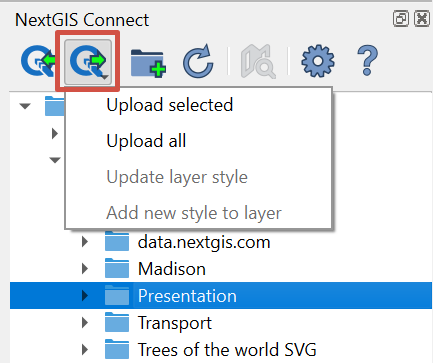
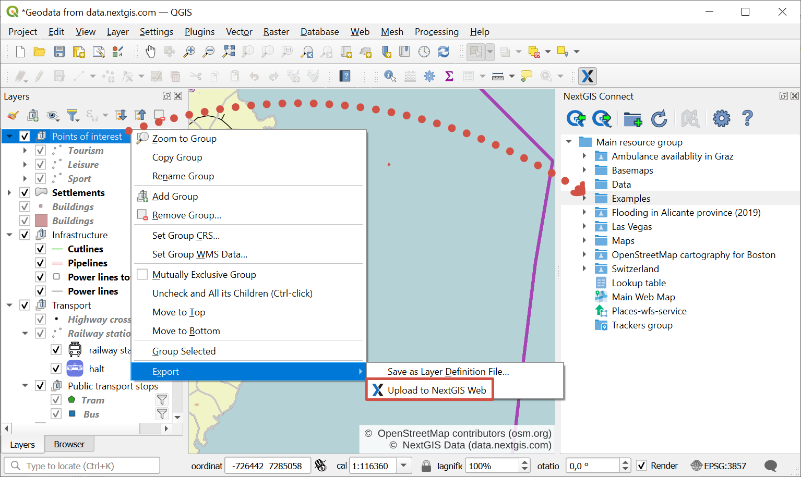
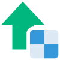
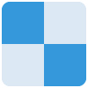
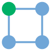
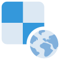
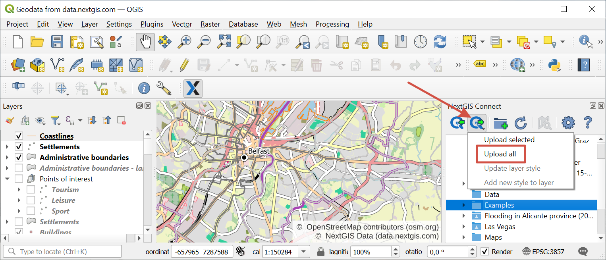
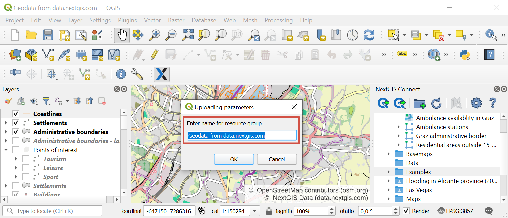
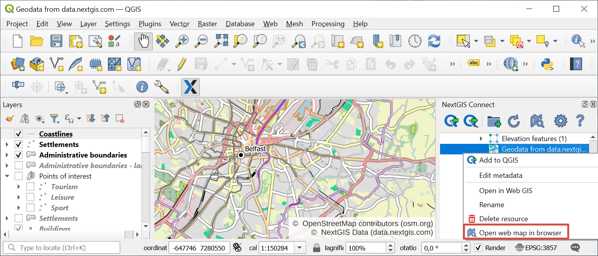

.. _ng_connect_data_transfer:

Upload data to the cloud storage
=================================

NextGIS Connect module allows you to share geodata between QGIS and Web GIS in both directions.

With NextGIS Connect you can upload to Web GIS:

1. Vector data
2. Raster data
3. Basemaps
4. Layer groups
5. Entire QGIS project

Connect plugin also allows to publish vector data using standard protocols :term:`WFS`, :term:`WMS` and OGC.

   
   Upload menu in the NG Connect panel

- Upload selected;
- Upload all - All layers for which the import option is available will be added to Web GIS, as well as all groups, retaining the hierarchy from QGIS Layers Panel.  Also a Web Map will be created and all imported layers will be added to it retaining hierarchy and visibility of QGIS Layers Panel. While importing a project you need to specify the name of the new resource group which will be created in Web GIS. This group will hold all resources imported along with the project. When the process is complete, the Web Map will be opened automatically if corresponding option is selected in plugin settings.
- Update layer style - Web GIS will update the style of the layer to match the style of the selected layer in QGIS.
- Add new style to layer - Web GIS will add to the layer a new style, similar to the selected layer in QGIS.

Imported resources will be added to the group selected in NextGIS Connect panel. 

* If other type of resource but a group is selected, import will be performed to the closest parent group to selected resource.
* If no resource is selected, import will be performed to the Main resource group (the root directory).

Attachments made in QGIS are also supported. See how it works in our video:

.. raw:: html

   <iframe width="560" height="315" src="https://www.youtube.com/embed/k427UYcXLOI?si=XCYPA-O3sEQuyyzm" title="YouTube video player" frameborder="0" allow="accelerometer; autoplay; clipboard-write; encrypted-media; gyroscope; picture-in-picture; web-share" referrerpolicy="strict-origin-when-cross-origin" allowfullscreen></iframe>

Watch on `youtube <https://youtu.be/k427UYcXLOI?si=oZ9vX7p6tGpmKv2r>`_.

Alternatively you can upload data to Web GIS from the Layers panel. In the context menu select it as one of the ways to export a layer, a group of layers or the entire project.

   Uploading data to Web GIS via layer context menu

.. _ng_connect_types:

Resource types 
--------------

The following types of resources are available for data exchange and operation:

.. |resource_vector_point| image:: _static/nextgis_connect/vector_layer_point.png
   :width: 6mm

.. |resource_vector_mpoint| image:: _static/nextgis_connect/vector_layer_mpoint.png
   :width: 6mm

.. |resource_vector_line| image:: _static/nextgis_connect/vector_layer_line.png
   :width: 6mm

.. |resource_vector_mline| image:: _static/nextgis_connect/vector_layer_mline.png
   :width: 6mm

.. |resource_vector_polygon| image:: _static/nextgis_connect/vector_layer_polygon.png
   :width: 6mm

.. |resource_vector_mpolygon| image:: _static/nextgis_connect/vector_layer_mpolygon.png
   :width: 6mm

.. |resource_webmap| image:: _static/symbol_webmap.png
   :width: 6mm

- |vector_layer| - Vector layer (NGW Vector Layer), which can be:  
  |resource_vector_point| - Point vector layer (NGW Vector Layer); 
  |resource_vector_mpoint| - Multipoint vector layer (NGW Vector Layer);  
  |resource_vector_line| - Line vector layer (NGW Vector Layer); 
  |resource_vector_line| - Multiline vector layer (NGW Vector Layer); 
  |resource_vector_polygon| - Polygon vector layer (NGW Vector Layer); 
  |resource_vector_mpolygon| - Multipolygon vector layer (NGW Vector Layer); 
  If a layer has **multiple styles**, they will all be uploaded. Their names will be kept. If the style name is "default", the layer's name will be used instead. 

- |resource_style| - Vector layer style
- |resource_wfs| - WFS Service 
- |resource_wms| - WMS Service 
- |tms_service_symbol| - TMS Layer
- |postgis_layer_symbol| - PostGIS Layer
- |wfs_layer_symbol| - WFS Layer
- |raster_layer| - Raster layer -  raster layer with a default style will be created in Web GIS. Style can be added directly to Web Map.
- |basemap_symbol| - Basemap
- |resource_webmap| - Web Map
- |resource_group| - Resource group

.. _qgis_project:

Upload entire QGIS project
-------------------------------

* Create a QGIS project with raster and vector layers. Tailor their styles, group them, set their hierarchy and visibility settings. Set the map extent;
* In NextGIS Connect panel select Resource group to which you want to upload the project;
* Press **Add to Web GIS** button on NextGIS Connect control panel and select **Upload all**;

   
   Adding project in the NextGIS Connect panel. Target resource group is highligthed in blue
   
* In the opened dialog window enter the name of the new Resource group to which the project will be imported;

   
   Entering the name for the project

* If the project is uploaded successfully you'll see in a selected Resource group a newly created group with: 

1) all Raster and Vector layers to which **Add to Web GIS** operation is applicable, and their Styles;
2) automatically created `Web map <https://docs.nextgis.com/docs_ngweb/source/webmaps_client.html#ngw-webmaps-client>`_ with a set extent, to which all the imported layers are added with groups, hierarchy and visibility settings similar to QGIS. 

.. tip:: 
	To view the newly created Web map press **Open map in browser** button on NextGIS Connect control panel or select **Open map in browser** in the context menu.

   
   Opening the newly created Web Map via context menu of the imported project

If you select a resource group containing layers with multiple styles, all the styles will be added. The style used as current will be the one with the same name as the layer or the first in alphabetical order. No dialog will be displayed.

.. raw:: html

   <iframe width="560" height="315" src="https://www.youtube.com/embed/Wwx1mowUAL4?si=pSrv-l2C2Nvqd9eH" title="YouTube video player" frameborder="0" allow="accelerometer; autoplay; clipboard-write; encrypted-media; gyroscope; picture-in-picture; web-share" referrerpolicy="strict-origin-when-cross-origin" allowfullscreen></iframe>

Watch on `youtube <https://youtu.be/Wwx1mowUAL4?si=g1ErxArjC4GewSsh>`__.

.. _vector_data:

Upload vector data
------------------------------

.. important:: 
   You can avoid `data format limitations <https://docs.nextgis.com/docs_ngweb/source/layers.html#ngw-vector-data-requirements>`_ when uploading vector data to Web GIS through NextGIS Connect by switching on options "Rename forbidden fields" and "Fix incorrect geometries" in *Settings* dialog.

In QGIS create from scratch or upload from :term:`ESRI Shape`, :term:`GeoJSON` or :term:`CSV` files vector layers. Tailor their styles;
* In NextGIS Connect panel select Resource group to which you want to upload your data (or create a new one using `Create resource group <https://docs.nextgis.com/docs_ngconnect/source/manage.html#ng-connect-res-group>`_ button);
* In QGIS Layers panel select the vector layer which you want to upload to Web GIS;
* Press **Add to Web GIS** button on NextGIS Connect control panel and click **Upload selected** or choose **NextGIS Connect --> Upload selected** in layer context menu;
* If data is uploaded successfully you'll see in the relevant Resource group a new Vector layer with `QGIS style <https://docs.nextgis.com/docs_ngweb/source/mapstyles.html>`_ tailored by you.

If a layer has **multiple styles**, they will all be uploaded. Their names will be kept. If the style name is "default", the layer's name will be used instead. 

See how to work with multi-style layers in our video:

.. raw:: html

   <iframe width="560" height="315" src="https://www.youtube.com/embed/7vwt1k6Cv3k?si=5FIwWTQU4UeCNMw3" title="YouTube video player" frameborder="0" allow="accelerometer; autoplay; clipboard-write; encrypted-media; gyroscope; picture-in-picture; web-share" referrerpolicy="strict-origin-when-cross-origin" allowfullscreen></iframe>

Watch on `youtube <https://youtu.be/7vwt1k6Cv3k?si=db1YkX-aS7f3_sd7>`__.

Vector layers added from Web GIS can be `edited in QGIS <https://docs.nextgis.com/docs_ngconnect/source/edit.html#>`_ right away.
   

.. _raster_data:

Upload raster data
----------------------------

* Add raster layers to QGIS from :term:`GeoTIFF` file;

.. note:: A raster layer in a different format, e.g. PostGIS, can also be uploaded to Web GIS via Connect. It will be transformed to EPSG:3857 GeoTIFF during uploading.

* In NextGIS Connect panel select Resource group to which you want to upload your data;
* In QGIS Layers panel select a raster layer which you want to upload to Web GIS;
* Press **Add to Web GIS** button on NextGIS Connect control panel and click **Upload selected** or choose **NextGIS Connect --> Upload selected** in layer context menu;
* If data is uploaded successfully you'll see in the relevant Resource group a new Raster layer  with default `Raster style <https://docs.nextgis.com/docs_ngweb/source/mapstyles.html#ngw-process-create-raster-style>`_.

See how to set transparancy for a raster layer, upload it and `create a Web Map <https://docs.nextgis.com/docs_ngconnect/source/resources.html#creating-web-map-from-a-layer>`_ from the layer in our video:

.. raw:: html

   <iframe width="560" height="315" src="https://www.youtube.com/embed/AA36g3CdGcU?si=YvqWTVMYnLt9-0sl" title="YouTube video player" frameborder="0" allow="accelerometer; autoplay; clipboard-write; encrypted-media; gyroscope; picture-in-picture; web-share" referrerpolicy="strict-origin-when-cross-origin" allowfullscreen></iframe>

Watch on `youtube <https://youtu.be/AA36g3CdGcU?si=d2JGjil-zMEbws4r>`_.

.. _basemaps:

Upload basemap
----------------

* Add basemaps to QGIS via TMS;
* In NextGIS Connect panel select Resource group to which you want to add your basemap;
* In QGIS Layers panel select a basemap which you want to upload to Web GIS;
* Press **Add to Web GIS** button on NextGIS Connect control panel and click **Upload selected** or choose **NextGIS Connect --> Upload selected** in layer context menu;
* If a basemap is uploaded successfully you'll see it the relevant Resource group.

