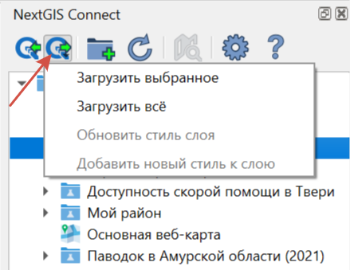
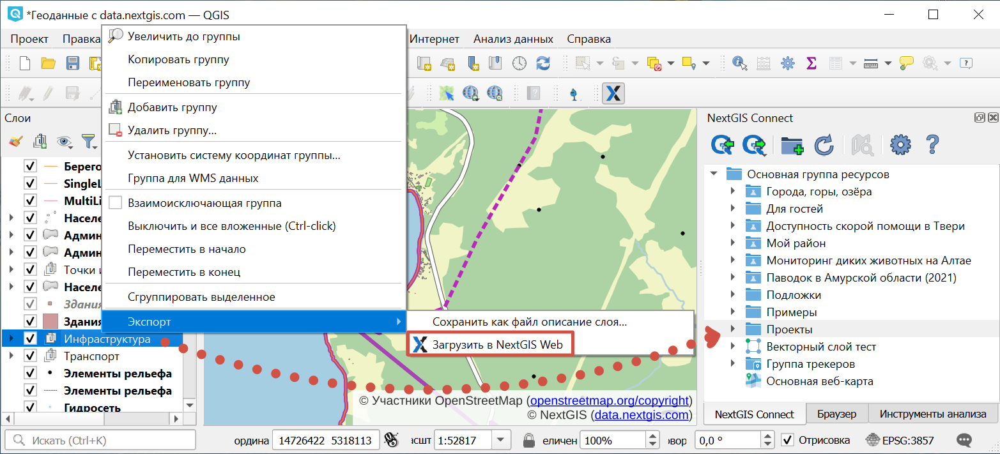
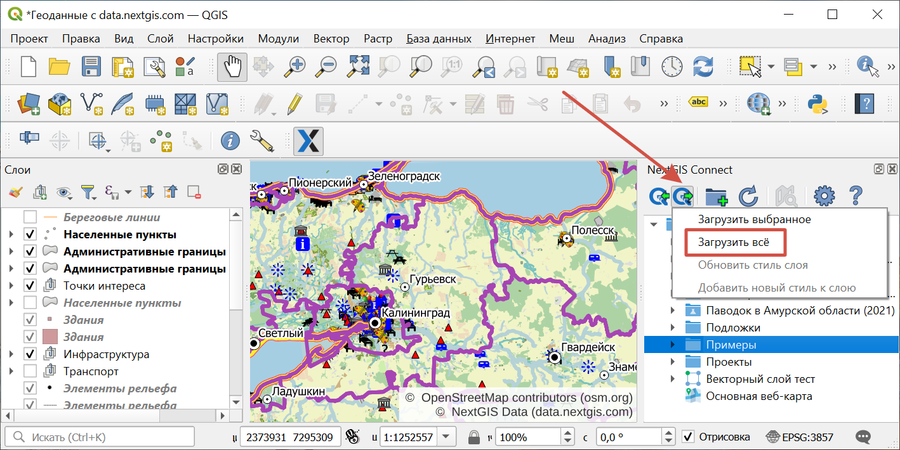
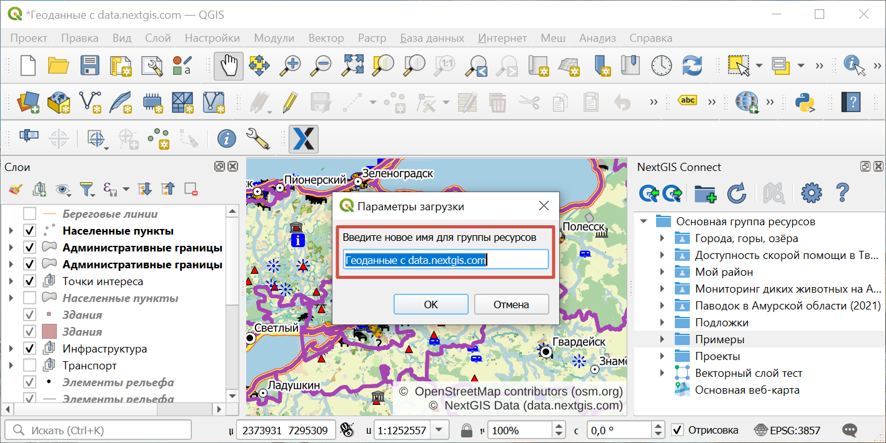
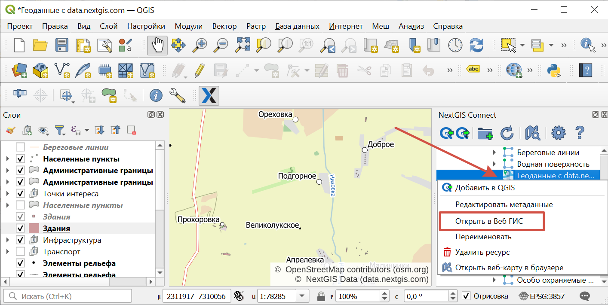

.. _ng_connect_data_transfer:

Загрузка данных в хранилище
============================

Модуль NextGIS Connect позволяет быстро загружать в Веб ГИС растровые и векторные данные, а также целиком проекты QGIS. Это позволит вам легко опубликовать в интернете свои карты и геоданные.

Модуль NextGIS Connect позволяет загружать в Веб ГИС:

1. Векторные данные
2. Растровые данные
3. Базовые карты (подложки)
4. Группы слоёв
5. `Проект QGIS целиком <https://docs.nextgis.ru/docs_ngconnect/source/ngc_data_transfer.html#qgis-project>`_.

Также модуль позволяет опубликовать векторные данные по стандартным протоколам :term:`WFS`, :term:`WMS` и OGC API - Features.

При нажатии на кнопку |button_to_wg| **Добавить в QGIS** откроется меню с несколькими вариантами:

.. |button_to_wg| image:: _static/button_to_wg.png
   :width: 6mm

   
   Меню загрузки данных в Веб ГИС в панели NG Connect

- Загрузить выбранное;
- Загрузить всё - В Веб ГИС будут добавлены все слои, для которых доступна операция "Импортировать выбранный слой", и все группы в соответствии с иерархией в панели слоёв QGIS. Также будет создана веб-карта, на которую будут добавлены все импортируемые слои с учетом иерархии и видимости в панели слоёв QGIS. Вам необходимо ввести название новой группы, которая будет создана в Веб ГИС для размещения всех ресурсов, импортируемых в рамках данной операции. После импорта проекта созданная веб-карта откроется в браузере автоматически, если в настройках модуля выбрана соответствуюйщая опция.
- Обновить стиль слоя - В Веб ГИС будет обновлен стиль слоя аналогично стилю выбранного слоя в QGIS.
- Добавить новый стиль к слою - В Веб ГИС будет добавлен новый стиль к слою, аналогично стилю выбранного слоя в QGIS.

Добавление ресурсов в Веб ГИС производится в выбранную на панели ресурсов Веб ГИС группу.

- Если выбрана не группа, а другой тип ресурса - в ближайшую родительскую группу выбранного ресурса.
- Если не выбран ресурс - в корневую группу.

Также поддерживается выгрузка в Веб ГИС вложений. Посмотрите, как это работает, в видео:

.. raw:: html

   <iframe width="560" height="315" src="https://rutube.ru/play/embed/4a8748602408662ce01012be6ed9ae51/" frameBorder="0" allow="clipboard-write; autoplay" webkitAllowFullScreen mozallowfullscreen allowFullScreen></iframe>

Посмотреть видео на `youtube <https://youtu.be/K9S8TPLYC9w>`_, `rutube <https://rutube.ru/video/4a8748602408662ce01012be6ed9ae51/>`_.

Загрузку данных в Веб ГИС можно выбрать как один из способов экспорта слоя, группы слоёв или проекта целиком.

   Загрузка данных в Веб ГИС через контекстное меню панели слоёв

.. _ng_connect_types:

Типы ресурсов 
--------------

Для обмена данными и работы доступны следующие типы ресурсов:

.. |resource_vector_point| image:: _static/nextgis_connect/vector_layer_point.png
.. |resource_vector_mpoint| image:: _static/nextgis_connect/vector_layer_mpoint.png
.. |resource_vector_line| image:: _static/nextgis_connect/vector_layer_line.png
.. |resource_vector_mline| image:: _static/nextgis_connect/vector_layer_mline.png
.. |resource_vector_polygon| image:: _static/nextgis_connect/vector_layer_polygon.png
.. |resource_vector_mpolygon| image:: _static/nextgis_connect/vector_layer_mpolygon.png
.. |resource_wfs| image:: _static/symbol_wfs_service.png
   :width: 6mm
.. |resource_wms| image:: _static/symbol_wms_service.png
   :width: 6mm
.. |resource_style| image:: _static/symbol_qgis_vector_style.png
   :width: 6mm
.. |resource_webmap| image:: _static/symbol_webmap.png
   :width: 6mm
.. |resource_group| image:: _static/symbol_resource_group.png
   :width: 6mm
.. |raster_layer| image:: _static/symbol_raster_layer.png
   :width: 5mm
.. |vector_layer| image:: _static/symbol_vector_layer.png
   :width: 6mm
.. |basemap_symbol| image:: _static/symbol_basemap.png
   :width: 5mm
.. |tms_layer_symbol| image:: _static/symbol_tms_layer.png
   :width: 6mm
.. |tms_connection_symbol| image:: _static/symbol_tms_connection.png
   :width: 6mm
.. |postgis_layer_symbol| image:: _static/symbol_postgis_layer.png
   :width: 6mm
.. |demo_project_symbol| image:: _static/symbol_demo_project.png
   :width: 6mm
.. |wms_layer_symbol| image:: _static/symbol_wms_layer.png
   :width: 6mm
.. |wms_connection_symbol| image:: _static/symbol_wms_connection.png
   :width: 6mm
.. |wfs_layer_symbol| image:: _static/symbol_wfs_layer.png
   :width: 6mm

- |vector_layer| - Векторный слой (NGW Vector Layer), он может быть: 
  |resource_vector_point| Точечный; 
  |resource_vector_mpoint| Мультиточечный; 
  |resource_vector_line| Линейный; 
  |resource_vector_line| Мультилинейный; 
  |resource_vector_polygon| Полигональный; 
  |resource_vector_mpolygon| Мультиполигональный; 
  В Веб ГИС будет создан векторный слой и стиль, аналогичный стилю выбранного слоя в QGIS, который можно добавить на веб-карту в Веб ГИС. При загрузке слоя с **несколькими стилями** в NGW, они загружаются со своими именами. Если название стиля - default (или "по умолчанию"), используется название слоя. 

- |resource_style| - Стиль векторного слоя.
- |resource_wfs| - WFS Сервис (NGW WFS Service)
- |resource_wms| - WMS Сервис (NGW WMS Service)
- |tms_layer_symbol| - Слой TMS
- |postgis_layer_symbol| - Слой PostGIS
- |wfs_layer_symbol| - Слой WFS
- |raster_layer| - Растровый слой (NGW Raster Layer) В Веб ГИС будет создан растровый слой со стилем по умолчанию, который можно добавить на веб-карту в Веб ГИС.
- |basemap_symbol| - Подложка
- |resource_webmap| - Веб карта (NGW Web Map)
- |resource_group| - Группа ресурсов

.. _qgis_project:

Загрузка проекта QGIS целиком
-------------------------------

* Соберите в QGIS проект из растровых и векторных слоев. Настройте их стили отображения, иерархию, группировку, видимость. Настройте охват карты;
* Выберите в дереве ресурсов Веб ГИС в окне модуля NextGIS Connect Группу ресурсов, в которую вы хотите загрузить проект;
* Нажмите кнопку **Загрузить всё** на панели инструментов модуля;

   
   Импорт текущего проекта
   
* В открывшемся диалоговом окне укажите название новой Группы ресурсов, в которую будет загружен проект;

   
   Указание имени импортируемого проекта

* Если проект загрузился успешно, то в соответствующей Группе ресурсов появится новая Группа ресурсов с заданным названием, внутри которой будут находиться: 

1) все Растровые и Векторные слои, для которых доступна операция *Добавить в Веб ГИС*, а также их Стили;
2) автоматически созданная `Веб-карта <https://docs.nextgis.ru/docs_ngweb/source/webmaps_client.html#ngw-webmaps-client>`_ с заданным охватом, на которую будут добавлены все импортированные слои с учетом их группировки, иерархии и видимости в панели слоёв QGIS.

.. note:: 
	Быстро перейти к Веб-карте можно, нажав кнопку **Открыть карту в браузере** на панели инструментов модуля или выбрав соответствующую команду в контекстном меню Веб-карты.

   
   Открытие импортированного проекта в Веб ГИС через контекстное меню

При добавлении группы ресурсов, которая содержит слои **с несколькими стилями**, будут добавлены все стили и выбран в качестве текущего либо одноименный слою, либо первый по алфавиту. Диалог с выбором показан не будет.

.. raw:: html

   <iframe width="560" height="315" src="https://rutube.ru/play/embed/f374bd300335a78dddd017a0c0934eec/" frameBorder="0" allow="clipboard-write; autoplay" webkitAllowFullScreen mozallowfullscreen allowFullScreen></iframe>

Смотреть на `youtube <https://youtu.be/qIByQEqZ4oQ>`__, `rutube <https://rutube.ru/video/f374bd300335a78dddd017a0c0934eec/>`__.

.. _vector_data:

Загрузка векторных данных
------------------------------

.. important:: 
   Вы можете избежать `ограничений по форматам данных <https://docs.nextgis.ru/docs_ngweb/source/layers.html#ngw-vector-data-requirements>`_ при загрузке векторных данных в Веб ГИС через NextGIS Connect, применив опции "Переименовывать запрещенные поля" и "Исправлять некорректные геометрии" в диалоге :guilabel:`Настройки`.

* Создайте в QGIS "с нуля" или добавьте из файлов векторные слои :term:`ESRI Shape`, :term:`GeoJSON` или :term:`CSV`. Настройте стили их отображения;
* Выберите в дереве ресурсов Веб ГИС в окне модуля NextGIS Connect Группу ресурсов, в которую вы хотите загрузить данные (или создайте её с помощью кнопки "`Создать новую группу ресурсов <https://docs.nextgis.ru/docs_ngconnect/source/manage.html#ng-connect-res-group>`_");
* Выберите в панели слоев QGIS векторный слой, который вы хотите загрузить в Веб ГИС;
* Нажмите кнопку **Добавить в Веб ГИС** на панели инструментов модуля и кликните **Загрузить выбранное** в меню или нажмите **NextGIS Connect --> Загрузить выбранное** в контекстном меню слоя;
* Если данные загрузились успешно, то в соответствующей Группе ресурсов появится новый Векторный слой, внутри которого будет создан `Стиль QGIS <https://docs.nextgis.ru/docs_ngweb/source/mapstyles.html>`_ с заданными настройками стиля.

При загрузке слоя **с несколькими стилями** в Веб ГИС, они загружаются со своими именами. Если название стиля - default (или "по умолчанию"), используется название слоя. 

.. raw:: html

   <iframe width="560" height="315" src="https://rutube.ru/play/embed/d65766eacd8a3f162fff6ce09556045b/" frameBorder="0" allow="clipboard-write; autoplay" webkitAllowFullScreen mozallowfullscreen allowFullScreen></iframe>

Посмотреть видео на `youtube <https://youtu.be/snq2yv8iNEk>`_, `rutube <https://rutube.ru/video/d65766eacd8a3f162fff6ce09556045b/>`_.

.. _raster_data:

Загрузка растровых данных
----------------------------

* Добавьте в QGIS из файлов растровые слои :term:`GeoTIFF`;

.. note:: Если растровый файл сохранён в другом формате, например, PostGIS, то при загрузке он будет преобразован в GeoTIFF с проекцией EPSG:3857.

* Выберите в дереве ресурсов Веб ГИС в окне модуля NextGIS Connect Группу ресурсов, в которую вы хотите загрузить данные;
* Выберите в панели слоев QGIS растровый слой, который вы хотите загрузить в Веб ГИС;
* Нажмите кнопку **Добавить в Веб ГИС** на панели инструментов модуля и кликните **Загрузить выбранное** в меню или нажмите **NextGIS Connect --> Загрузить выбранное** в контекстном меню слоя;
* Если данные загрузились успешно, то в соответствующей Группе ресурсов появится новый Растровый слой , внутри которого будет создан `Растровый стиль <https://docs.nextgis.ru/docs_ngweb/source/mapstyles.html#ngw-process-create-raster-style>`_ с настройками стиля по умолчанию.

Посмотрите, как это работает, в видео:

.. raw:: html

   <iframe width="560" height="315" src="https://rutube.ru/play/embed/be92d2c9959a434d09f41ec1e715b276/" frameBorder="0" allow="clipboard-write; autoplay" webkitAllowFullScreen mozallowfullscreen allowFullScreen></iframe>

Посмотреть видео на `youtube <https://youtu.be/b2CudmkYUOQ>`_, `rutube <https://rutube.ru/video/be92d2c9959a434d09f41ec1e715b276/>`_.

.. _basemaps:

Загрузка базовых карт (подложек)
---------------------------------

* Добавьте в QGIS базовую карту (подложку);
* Выберите в дереве ресурсов Веб ГИС в окне модуля NextGIS Connect Группу ресурсов, в которую вы хотите добавить подложку;
* Выберите в панели слоев QGIS подложку, которую вы хотите загрузить в Веб ГИС;
* Нажмите кнопку **Добавить в Веб ГИС** на панели инструментов модуля и кликните **Загрузить выбранное** в меню или нажмите **NextGIS Connect --> Загрузить выбранное** в контекстном меню слоя;
* Если подложка загрузилась успешно, то она появится в соответствующей Группе ресурсов.

 

