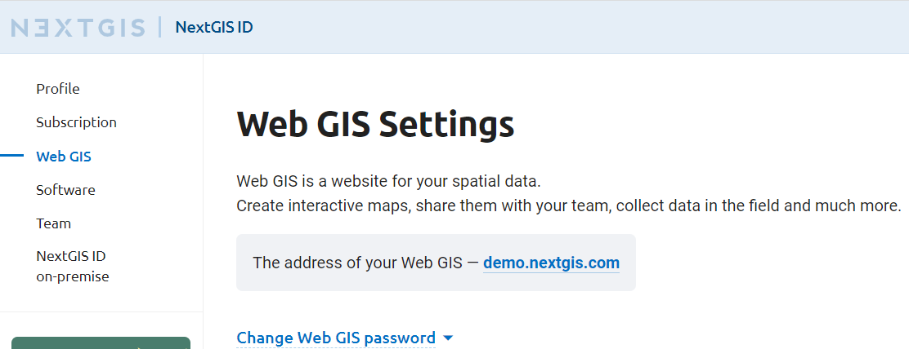
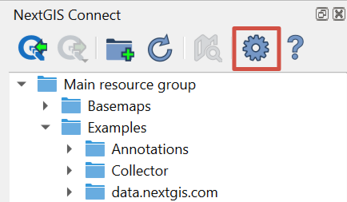
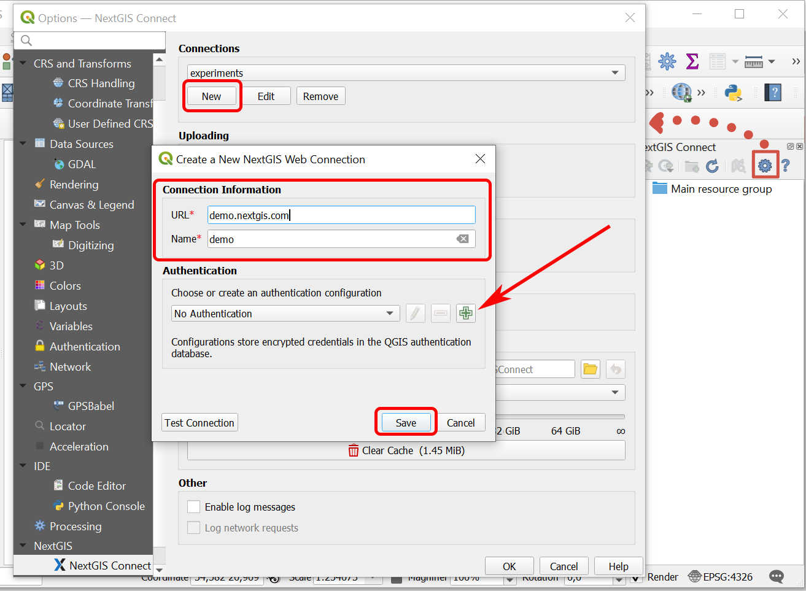
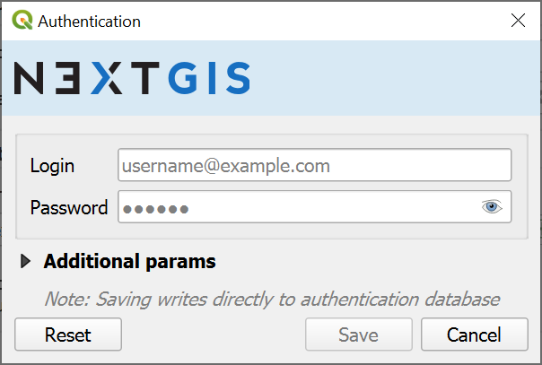

.. _ng_connect_install:

Installation
==============

To download NextGIS Connect plugin, from the main menu open *Plugins ‣ Manage and install plugins*. Start typing the name of the plugin in the search bar, select it in the list and press **Install**.

NextGIS Connect plugin is a part of `NextGIS QGIS <http://nextgis.com/nextgis-qgis/>`_ distributive and is ready to go right after installation of desktop app.

If you need to check the version of the plugin or update it, go to *Plugins‣ Manage and install plugins ‣ NextGIS Connect*. 

.. note:: Qt6 compatible

When the plugin is installed, its icon appears in the toolbar:  

.. figure:: _static/logo_connect.png
   :align: center
   :alt: NextGIS Connect icon

Click on the icon to open NextGIS Connect panel. `More about Connect panel <https://docs.nextgis.com/docs_ngconnect/source/panel.html>`_.

.. figure:: _static/connect_panel_en_2.png
   :align: center
   :alt: NextGIS Connect panel
   :width: 10cm
   
   NextGIS Connect panel

First you need to create a connection to Web GIS.

.. _ng_connect_new_connection:

Create a connection
--------------------

To create a connection you need to know the address of your Web GIS.
The address for your own Web GIS can be found at
https://my.nextgis.com/webgis

   
   Web GIS address

Click on **Settings** button in NextGIS Connect panel.

   Opening Settings menu

In the pop-up window press **New** and fill in the fields: 

1.	URL – address of the target Web GIS.
2.	Name – connection id, how it will be shown in the list of connections.

   
   Adding new connection

Next, in the *Authentication* section, choose how you wish to log in to the Web GIS:

* The default setting, "No Authentication" (= as a Guest) can be used if you don't need to perform actions that a Guest has no permissions for;
* `add a new configuration <https://docs.nextgis.ru/docs_ngconnect/source/ngc_install.html#nnew-config>`_;
* select a previously created one (the list items consist of configuration name, user name and authentication type).

.. note:: For instance, only the Web GIS owner and the `team members <https://docs.nextgis.com/docs_ngcom/source/create.html#team-management>`_ can create and delete resources.

.. _new_config:

Add a new configuration
~~~~~~~~~~~~~~~~~~~~~~~

.. important:: If you used Google account to log in to NextGIS services, you need to create an additional password for the Connect module. Go to `this page <https://my.nextgis.com/password/reset/?email=>`_ and follow the instructions. After creating this password, you can still sign in with Google on web-based NextGIS services.

Press the button with a green plus in the Connection dialog (:numref:`create_connection_pic`).

The "Authentication" dialog will pop up.

   
   Adding authentication configuration

1. Enter *Username* (email used for registration) and *Password* of your NextGIS ID;
2. Press **Save**.

Make sure that the correct configuration is selected. To check if the credentials are correct, press **Test Connection**. 

If guest or user chosen for authentication does not have access at least to the Main resource group of the Web GIS, an error message will appear. Select a different authentication configuration or contact the administrator of the Web GIS to get access permission.

Next press **Save** in the connection creating dialog (:numref:`create_connection_pic`). 

Click **OK**. 

The connection selected in the "Connections" dropdown menu of the Settings dialog will become active **after** the dialog is closed.

Keycloak authentication in NextGIS QGIS
----------------------------------------

Desktop app NextGIS QGIS, NextGIS Web, and NextGIS Connect which serves as a link between them handle geoinformation systems that use Keycloak authorization. 

This option is relevant for corporate users who have a Web GIS deployed `on-premise <https://nextgis.com/pricing/>`_.
