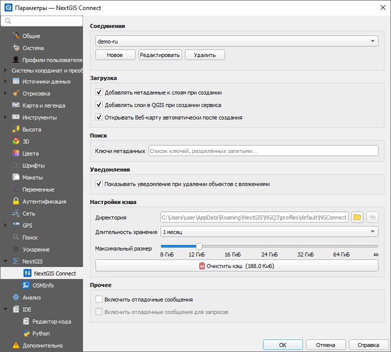
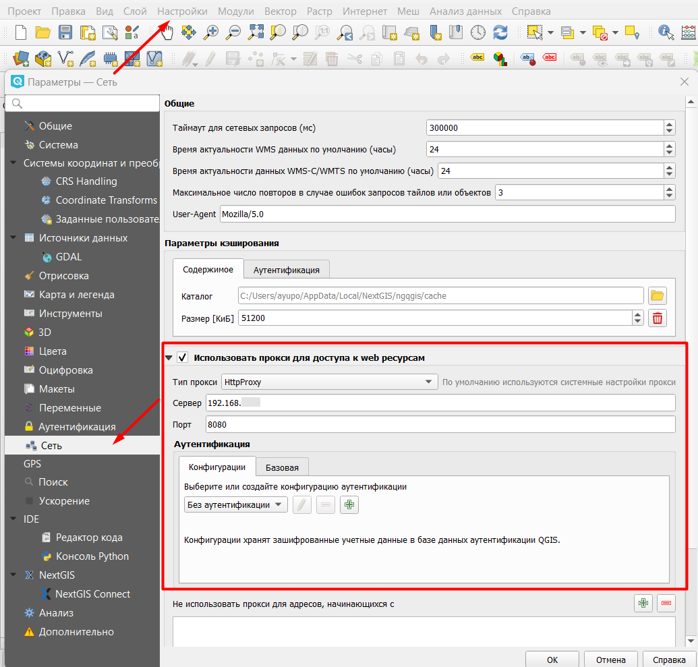

.. _ng_connect_main_settings:

Основные настройки
===================

Меню настроек можно открыть из верхнего меню или нажав кнопку с шестеренкой в панели NextGIS Connect.

.. figure:: _static/nextgis_connect/call_settings_ru.png
   :align: center
   :alt: Вызов диалога настроек
   :width: 10cm

   Вызов диалога настроек

   
   Диалог основных настроек подключения

.. _ngc_set_connect:

Соединения
~~~~~~~~~~~

В выпадающем списке выбирается подключение, которое станет активным **после закрытия** диалога.

Также здесь можно `создать новое соединение <https://docs.nextgis.ru/docs_ngconnect/source/ngc_install.html#ng-connect-new-connection>`_, редактировать и удалять существующие.

.. _ngc_set_upload:

Загрузка
~~~~~~~~~

* **Добавлять метаданные к слоям при создании**
* **Добавлять слои в QGIS при создании сервиса**
* **Открывать веб-карту автоматически после создания** - при включении этой опции после загрузки проекта целиком в Веб ГИС или создания веб-карты из слоя при помощи панели NextGIS Connect автоматически открывается окно браузера с просмотром этой веб-карты.

.. _ngc_set_search:

Поиск
~~~~~~

Здесь можно задать список ключей метаданных, чтобы `при поиске <https://docs.nextgis.ru/docs_ngconnect/source/filter.html#ngc-filter-metadata>`_ не вводить их вручную, а выбирать из списка.

.. _ngc_set_notifications:

Уведомления
~~~~~~~~~~~~

**Показывать уведомление при удалении объектов с вложениями** - удаление объекта приводит также к удалению всех его вложений. Уведомление предупреждает об этом, чтобы дать пользователю возможность убедиться, что при удалении не потеряются важные файлы.

.. _ngc_set_cache:

Настройки кэша
~~~~~~~~~~~~~~~~~

Можно настроить следующие параметры сохранения кэша:

**Директория** - адрес размещения кэша, по умолчанию это папка, куда установлена программа.

**Длительность хранения кэша** - устанавливает интервал очистки кэша: 1 день, неделя или месяц. Также можно выбрать бессрочное хранение.

**Максимальный размер кэша** - 8, 12, 16, 24, 32, 64 гигабайта или без ограничений (знак бесконечности).

Также доступна **очистка кэша**.

.. _ngc_set_other:

Прочее
~~~~~~~

Это пригодится, если нужно сообщить разработчикам о багах. Отладочные сообщения позволяют получить информацию том, что происходило до ошибки и место, в котором она возникла. 

**Включить отладочные сообщения** - если опция выбрана, то все отладочные сообщения будут автоматически выводиться на экран в панели “Отладочные сообщения”. 

**Включить отладочные сообщения для запросов** - опция  добавляет информацию о том, какие запросы были произведены, их содержимое и ответ.

.. _ng_connect_proxy:

Настройки Прокси-сервера
------------------------

Если в вашей организации используется свой прокси-сервер, нужно прописать его настройках NextGIS QGIS:

*Верхнее меню > Настроки > Параметры > Сеть > Использовать прокси для доступа к web ресурсам*.

   
   Настройки прокси сервера
