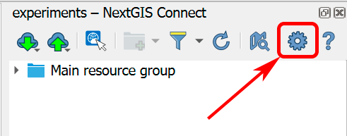
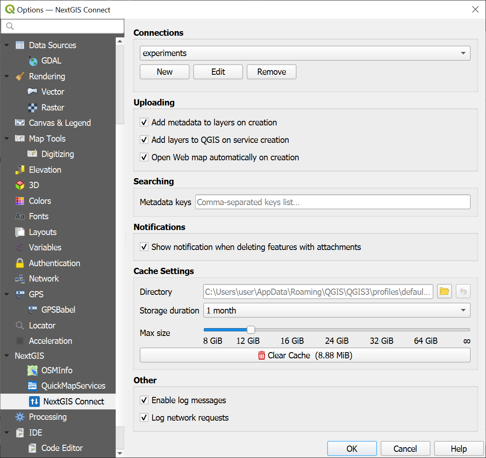
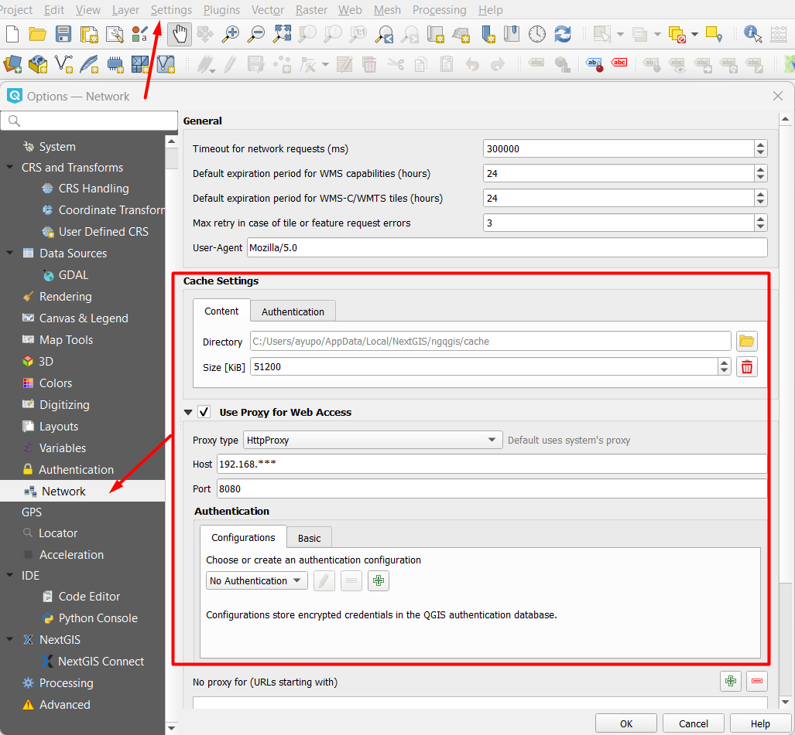

.. _ng_connect_main_settings:

Main Settings
===================

You can access this dialog via top menu Settings > Options > NextGIS Connect, or from NextGIS Connect panel by clicking on the gear button.

   Opening Settings menu

   
   Main settings dialog

.. _ngc_set_connect:

Connections
~~~~~~~~~~~

Connection, selected in the dropdown list, becomes active **after** the Settings dialog is closed.

Also, in this section you can `create, edit or delete connections <https://docs.nextgis.com/docs_ngconnect/source/ngc_install.html#create-a-connection>`_.

.. _ngc_set_upload:

Uploading
~~~~~~~~~

* **Add metadata to layers on creation**
* **Add layers to QGIS on service creation**
* **Open Web Map automatically on creation** - if this option is enabled, after you upload an entire project or create a Web Map from a layer in NextGIS Connect panel, a browser automatically opens to display that Web Map.

.. _ngc_set_search:

Search
~~~~~~

Here you enter a list of metadata keys so that in the `search bar <https://docs.nextgis.com/docs_ngconnect/source/filter.html#ngc-filter-metadata>`_ you could select from a dropdown menu instead of entering them manually.

.. _ngc_set_notifications:

Notifications
~~~~~~~~~~~~~

**Show notification when deleting features with attachments** - when you delete a feature, all its attachments are deleted too. The message helps you avoid accidentally losing important files.

.. _ngc_set_cache:

Cache settings
~~~~~~~~~~~~~~~

You can manage the following parameters:

**Directory** - path to the cache folder, by default - the folder containing the app.

**Storage duration** - determines how often is cache cleared: once a day, a week or a month. There is also the option to store cache indefinitely.

**Max size** - 8, 12, 16, 24, 32, 64 GiB or no restriction (the infinity symbol).

You can also **Clear cache**.

.. _ngc_set_other:

Other settings
~~~~~~~~~~~~~~

The following settings are used to inform the developers about software errors and bugs. Log messages contain the information on the events leading to an error and the place where it ocurred. 

**Enable log messages** - all debug messages will be automatically displayed in the “Debug messages” panel. 

**Log network requests** - adds information about requests made, their contents and the response to the debug messages.

.. _ng_connect_proxy:

Proxy server settings
------------------------

If your company uses its own proxy server, you need to specify it in the NextGIS QGIS settings:

*Main menu > Settings > Options > Network > Use Proxy for Web Access*.

   
   Proxy server settings
