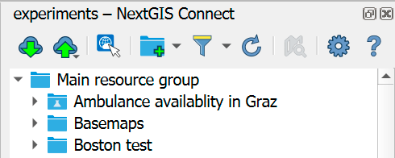
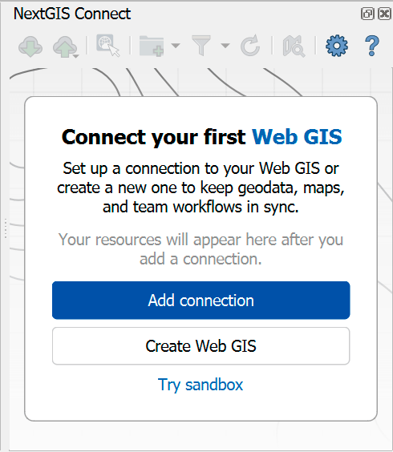
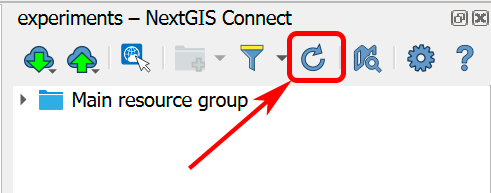
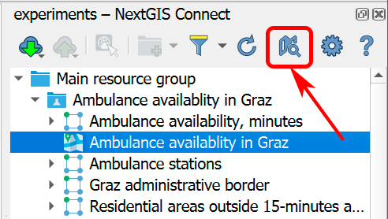
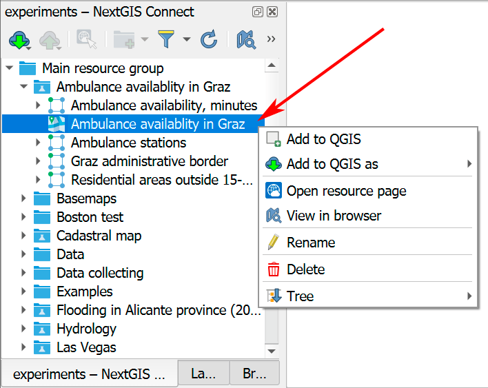

Plugin interface
================

   
   NextGIS Connect panel

Buttons on the panel:

* |button_cloud_download| `Add to QGIS <https://docs.nextgis.com/docs_ngconnect/source/resources.html>`_

* |button_cloud_upload| `Add to Web GIS <https://docs.nextgis.com/docs_ngconnect/source/resources.html#ng-connect-export>`_

* |button_c_identify| Identify features in Web GIS layers

* |button_newfolder| `Create resource group <https://docs.nextgis.com/docs_ngconnect/source/manage.html#ng-connect-res-group>`_ or |button_c_new_layer| `a new vector layer <https://docs.nextgis.com/docs_ngconnect/source/manage.html#new-vector-layer>`_

* |button_filter| `Search and filter resources <https://docs.nextgis.com/docs_ngconnect/source/filter.html>`_

* |button_refresh| `Refresh resource tree <https://docs.nextgis.com/docs_ngconnect/source/panel.html#connect-refresh>`_

* |button_openmap| `Open Web Map in browser <https://docs.nextgis.com/docs_ngconnect/source/panel.html#connect-open-webmap>`_

* |button_settings| `Plugin settings <https://docs.nextgis.com/docs_ngconnect/source/ngc_settings.html>`_

* |button_help| Help - opens this manual

If no connection is set at the moment, the following message will be shown:

   
   NextGIS Connect panel if there is no connection

If the previously used version of NextGIS Connect didn't support QGIS authentication, after the update you will need to convert all existing connections and authentication data. You can do it in the NextGIS Connect panel or in the `plugin settings <https://docs.nextgis.com/docs_ngconnect/source/ngc_settings.html>`_.

.. figure:: _static/connect_update_convert_en.png
   :align: center
   :name: connect_update_convert_pic
   :alt: NextGIS Connect panel after update
   :width: 10cm

   Message announcing the need to convert connections

.. figure:: _static/ngc_upd_convert_menu_en.png
   :align: center
   :name: ngc_upd_convert_menu_pic
   :alt: NextGIS Connect settings after update
   :width: 22cm

   Message announcing the need to convert connections in NextGIS Connect settings

.. _connect_refresh:

Refresh
----------

Click |button_refresh| to refresh the entire Web GIS resource tree so that it's up to date with the current state of the server.

   Refreshing Web GIS data

.. _connect_open_webmap:

Display in browser
-----------------------------

If a Web Map (|resource_webmap| NGW Web Map), a gallery, a layer or a style is selected in NextGIS Connect resource tree, click |button_openmap| to preview the resource in a new tab of the default browser.

   Opening a Web Map

Context menu also allows to display a Web Map, gallery, layer or style in browser or to `open the Web GIS page of any resource <https://docs.nextgis.com/docs_ngconnect/source/panel.html#ng-connect-cont-menu>`_.

.. _ng_connect_cont_menu:

Context Menu
----------------

Context menu may differ depending on resource type.  

   
   Context menu example

Common options for all resource types:

- Open in WebGIS – open the page of the selected resource in Web GIS, also can be donde from the Layers panel, see :numref:`ngc_open_from_layertree_pic`;

- Rename resource;

- `Delete resource <https://docs.nextgis.com/docs_ngconnect/source/manage.html#connect-resource-delete>`_;

- Tree - display or hide all child resources.

Variable options – depend on resource type:

- Add to QGIS and Add to QGIS as - `see above <https://docs.nextgis.com/docs_ngconnect/source/resources.html#ng-connect-export>`_ for the types of resources that can be added and other details;
- `View in browser <https://docs.nextgis.com/docs_ngconnect/source/panel.html#connect-open-webmap>`_ - available for Web Maps, galleries, layers and styles; opens a web client displaying the map/gallery or the preview of the layer or style;
- Layer history - available for vector layers with versioning enabled, opens the `history of actions for the layer <https://docs.nextgis.com/docs_ngweb/source/version.html#vers-ngw-view-history>`_ in your browser;
- Create - you can create a new resource:

  - `Web Map <https://docs.nextgis.com/docs_ngconnect/source/manage.html#web-map>`_ - available for: Vector layer, Vector style, Raster layer, WMS Layer;
  - `WFS service <https://docs.nextgis.com/docs_ngconnect/source/resources.html#wfs>`_ - only for Vector layer and PostGIS layer;
  - `OGC API - Featues service <https://docs.nextgis.com/docs_ngconnect/source/resources.html#ogc-api-features>`_ - only for Vector layer and PostGIS layer;
  - `WMS service <https://docs.nextgis.com/docs_ngconnect/source/resources.html#wms>`_ - only for Vector layer, Raster layer and PostGIS layer;
  - `Form for data collection <https://docs.nextgis.com/docs_ngweb/source/collector.html#collector-create-form>`_ - only for Vector layer, opens in browsers.

- `Download as QML <https://docs.nextgis.com/docs_ngconnect/source/export.html#connect-save-style>`_ - only available for QGIS Vector style and QGIS Raster style;

- `Copy style <https://docs.nextgis.com/docs_ngconnect/source/edit.html#connect-style-copy>`_ - only available for QGIS Vector style and QGIS Raster style;

- `Duplicate resource <https://docs.nextgis.com/docs_ngcom/source/ngqgis_connect.html#ngcom-connect-resource-double>`_ - available only for Vector layer and Raster layer;

- `Overwrite selected layer <https://docs.nextgis.com/docs_ngconnect/source/edit.html#connect-data-overwrite>`_ - only available for Vector layer.

The plugin also allows you to navigate to the Web GIS data directly from the the Layers panel in QGIS. In the layer's context menu find "NextGIS Connect" and press "Open in Web GIS".

.. figure:: _static/ngc_open_from_layertree_en.png
   :align: center
   :alt: Context menu in the layer tree
   :name: ngc_open_from_layertree_pic
   :width: 22cm

   Opening Web GIS data from QGIS layer tree

.. |button_cloud_download| image:: _static/button_cloud_download.png
   :width: 6mm
   :alt: cloud with arrow down

.. |button_cloud_upload| image:: _static/button_cloud_upload.png
   :width: 6mm
   :alt: cloud with arrow up

.. |button_newfolder| image:: _static/button_newfolder.png
   :width: 6mm
   :alt: folder with a +

.. |button_c_new_layer| image:: _static/button_c_new_layer.png
   :width: 6mm
   :alt: rectangle with a +

.. |button_c_identify| image:: _static/button_c_identify.png
   :width: 6mm
   :alt: pointer with blue globe

.. |button_filter| image:: _static/button_filter.png
   :width: 6mm
   :alt: funnel

.. |button_refresh| image:: _static/button_refresh.png
   :width: 6mm
   :alt: round arrow

.. |button_openmap| image:: _static/button_openmap.png
   :width: 6mm
   :alt: map with magnifying glass

.. |button_settings| image:: _static/button_settings.png
   :width: 6mm
   :alt: blue gear

.. |button_help| image:: _static/button_help.png
   :width: 6mm
   :alt: question mark