Панель модуля
===============

В заголовке панели отображается домен Веб ГИС, к которой вы подключены в данный момент.

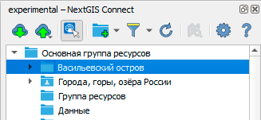
   
   Панель модуля расширения NextGIS Connect

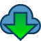

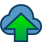

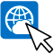

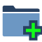

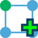

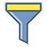

.. |button_settings| image:: _static/button_settings.png
   :width: 6mm
   :alt: синяя шестерёнка

На панели расположены следующие кнопки:

* |button_cloud_download| `Загрузить в QGIS <https://docs.nextgis.ru/docs_ngconnect/source/ngc_data_transfer.html>`_

* |button_cloud_upload| `Добавить в Веб ГИС <https://docs.nextgis.ru/docs_ngconnect/source/resources.html#ng-connect-export>`_

* |button_c_identify| Идентифицировать объекты в слоях Веб ГИС

* |button_newfolder| `Создать группу ресурсов <https://docs.nextgis.ru/docs_ngconnect/source/manage.html#ng-connect-res-group>`_ или |button_c_new_layer| `создать новый векторный слой <https://docs.nextgis.ru/docs_ngconnect/source/manage.html#new-vector-layer>`_

* |button_filter| `Фильтр и поиск ресурсов <https://docs.nextgis.ru/docs_ngconnect/source/filter.html>`_

* |button_refresh| `Обновить дерево ресурсов <https://docs.nextgis.ru/docs_ngconnect/source/panel.html#connect-refresh>`_

* |button_openmap| `Просмотр в браузере <https://docs.nextgis.ru/docs_ngconnect/source/panel.html#connect-open-webmap>`_

* |button_settings| `Настройки модуля <https://docs.nextgis.ru/docs_ngconnect/source/ngc_settings.html>`_

* |button_help| Справка - вы окажетесь здесь

Если на данный момент не настроено ни одно `подключение <https://docs.nextgis.ru/docs_ngconnect/source/ngc_install.html#ng-connect-new-connection>`_, вы увидите сообщение с предложением 
создать свою Веб ГИС.

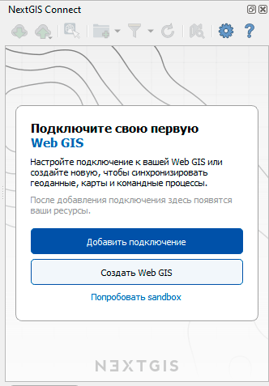
   
   Панель модуля расширения NextGIS Connect при отсутствии подключения

Если ранее на устройстве использовалась версия NextGIS Connect, не поддерживавшая аутентификацию QGIS, то при включении обновленной версии будет предложено конвертировать существующие соединения и данные аутентификации. Это можно сделать через окно NextGIS Connect, а также `в настройках модуля <https://docs.nextgis.ru/docs_ngconnect/source/ngc_settings.html>`_.

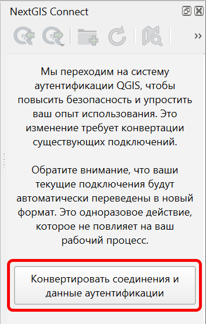

   Предупреждение о необходимости конвертации соединений

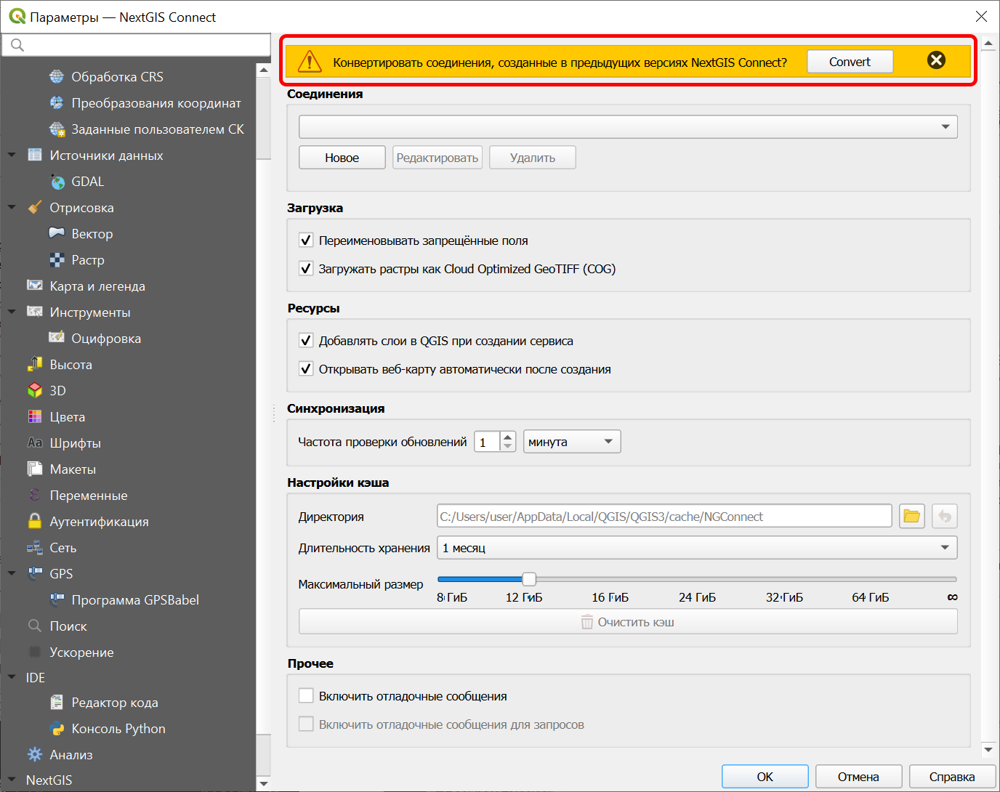

   Настройки модуля расширения NextGIS Connect после обновления с сообщением о конвертации

.. _connect_refresh:

Обновить
----------

Нажмите |button_refresh|, чтобы обновить всё дерево ресурсов Веб ГИС до актуального на текущий момент состояния.

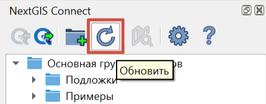

   Актуализация данных Веб ГИС

.. _connect_open_webmap:

Просмотр в браузере
----------------------

Выберите в дереве ресурсов веб-карту (NGW Web Map) |resource_webmap|, галерею, слой или стиль, и нажмите |button_openmap|, чтобы открыть просмотр этого ресурса в новой вкладке браузера.

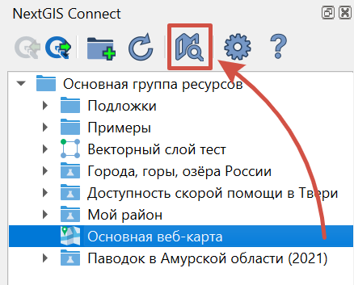

   Открытие веб-карты

Также это можно сделать через `контекстное меню <https://docs.nextgis.ru/docs_ngconnect/source/panel.html#ng-connect-cont-menu>`_.

.. _ng_connect_cont_menu:

Контекстное меню
----------------
Контекстное меню может отличаться у различных ресурсов. 

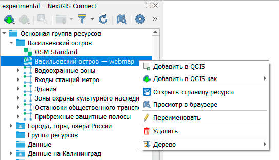
   
   Пример контекстного меню

Общедоступные операции для всех типов ресурсов:

- Открыть страницу ресурса - открывает страницу выбранного ресурса в Веб ГИС, также доступно из панели слоёв, см. :numref:`ngc_open_from_layertree_pic`;

- Переименовать ресурс;

- `Удалить ресурс <https://docs.nextgis.ru/docs_ngconnect/source/manage.html#connect-resource-delete>`_;

- Дерево - позволяет развернуть или свернуть все дочерние ресурсы.

Опциональные - зависят от типа ресурса:

- Добавить в QGIS и Добавить в QGIS как - операция и список ресурсов, для которых она доступна, описаны `в этом разделе <https://docs.nextgis.ru/docs_ngconnect/source/resources.html#ng-connect-export>`_;

- `Просмотр в браузере <https://docs.nextgis.ru/docs_ngconnect/source/panel.html#connect-open-webmap>`_ - доступен для веб-карт, галерей, слоёв и стилей, в браузере откроется веб-клиент с картой или страница превью слоя/стиля соответственно;

- История слоя - доступно для векторных слоёв с включённым версионированием, открывает в браузере `историю изменений слоя <https://docs.nextgis.ru/docs_ngweb/source/version.html#vers-ngw-view-history>`_;

- Создать новый ресурс:

  - `Веб Карту <https://docs.nextgis.ru/docs_ngconnect/source/manage.html#web-map>`_ - доступен для ресурсов: Векторный слой, Стиль Векторного слоя, Растровый слой, слой WMS;
  - `Сервис WFS <https://docs.nextgis.ru/docs_ngconnect/source/resources.html#wfs>`_ - доступен только для ресурсов Векторный слой, слой PostGIS;
  - `Сервис OGC API - Features <https://docs.nextgis.ru/docs_ngconnect/source/resources.html#ogc-api-features>`_ - доступен только для ресурсов Векторный слой и слой PostGIS;
  - `Сервис WMS <https://docs.nextgis.ru/docs_ngconnect/source/resources.html#wms>`_ - доступен только для ресурсов Векторный слой, Растровый слой, слой PostGIS;
  - `Форму сбора данных <https://docs.nextgis.ru/docs_ngweb/source/collector.html#collector-create-form>`_ - доступно для векторного слоя, откроется в браузере.

- `Загрузить как QML <https://docs.nextgis.ru/docs_ngconnect/source/export.html#connect-save-style>`_ - доступен только для ресурсов QGIS Стиль Векторного слоя и QGIS Стиль Растрового слоя;

- `Копировать стиль <https://docs.nextgis.ru/docs_ngconnect/source/edit.html#connect-style-copy>`_  - доступен только для ресурсов QGIS Стиль Векторного слоя и QGIS Стиль Растрового слоя;

- `Дублировать ресурс <https://docs.nextgis.ru/docs_ngconnect/source/ngc_data_transfer.html#connect-resource-double>`_ - доступен только для ресурсов: Векторный слой и Растровый слой;

- `Перезаписать выбранный слой <https://docs.nextgis.ru/docs_ngconnect/source/edit.html#connect-data-overwrite>`_ - доступен только для ресурсов Векторный слой и Растровый слой.

Кроме того, при установке модуля появляется возможность переходить к данным в Веб ГИС из панели слоев в QGIS: в контекстном меню слоя в QGIS найдите «NextGIS Connect», и нажмите «Открыть в Веб ГИС».

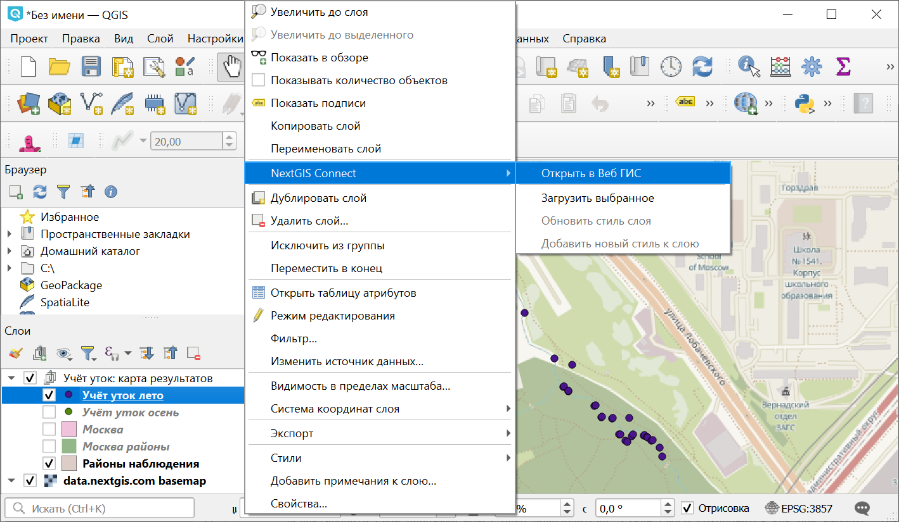

   Открытие данных в Веб ГИС из дерева слоев QGIS

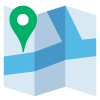