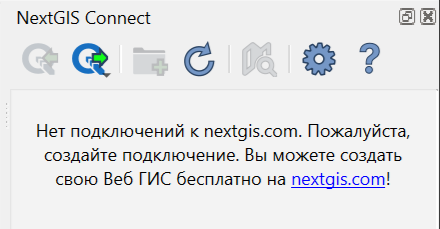
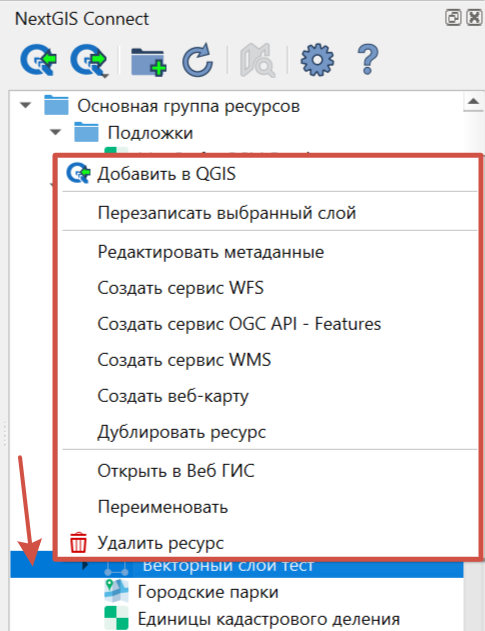

Панель модуля
===============

.. figure:: _static/connect_panel_ru_2.png
   :align: center
   :alt: Панель модуля расширения NextGIS Connect
   :width: 10cm
   
   Панель модуля расширения NextGIS Connect

.. |button_to_qgis| image:: _static/button_to_qgis.png
   :width: 6mm

.. |button_to_wg| image:: _static/button_to_wg.png
   :width: 6mm

.. |button_newfolder| image:: _static/button_newfolder.png
   :width: 6mm

.. |button_filter| image:: _static/button_filter.png
   :width: 6mm
   :alt: воронка

.. |button_refresh| image:: _static/button_refresh.png
   :width: 6mm

.. |button_openmap| image:: _static/button_openmap.png
   :width: 6mm
   :alt: карта с лупой

.. |button_settings| image:: _static/button_settings.png
   :width: 6mm
   :alt: синяя шестерёнка

.. |button_help| image:: _static/button_help.png
   :width: 6mm
   :alt: знак вопроса

На панели расположены следующие кнопки:

* |button_to_qgis| `Загрузить в QGIS <https://docs.nextgis.ru/docs_ngconnect/source/ngc_data_transfer.html#qgis>`_

* |button_to_wg| `Добавить в Веб ГИС <https://docs.nextgis.ru/docs_ngconnect/source/ngc_data_transfer.html#ng-connect-export>`_

* |button_newfolder| `Создать группу ресурсов <https://docs.nextgis.ru/docs_ngconnect/source/ngc_data_transfer.html#ng-connect-res-group>`_

* |button_filter| `Поиск и фильтрация ресурсов <https://docs.nextgis.ru/docs_ngconnect/source/filter.html>`_

* |button_refresh| `Обновить дерево ресурсов <https://docs.nextgis.ru/docs_ngconnect/source/ngc_data_transfer.html#connect-refresh>`_

* |button_openmap| `Просмотр в браузере <https://docs.nextgis.ru/docs_ngconnect/source/ngc_data_transfer.html#connect-open-webmap>`_

* |button_settings| `Настройки модуля <https://docs.nextgis.ru/docs_ngconnect/source/ngc_settings.html>`_

* |button_help| Справка - вы окажетесь здесь

Если на данный момент не настроено ни одно `подключение <https://docs.nextgis.ru/docs_ngconnect/source/ngc_install.html#ng-connect-new-connection>`_, вы увидите сообщение с предложением 
создать свою Веб ГИС.

   
   Панель модуля расширения NextGIS Connect при отсутствии подключения

Если ранее на устройстве использовалась версия NextGIS Connect, не поддерживавшая аутентификацию QGIS, то при включении обновленной версии будет предложено конвертировать существующие соединения и данные аутентификации. Это можно сделать через окно NextGIS Connect, а также в настройках модуля.

.. figure:: _static/nextgis_connect/connect_update_convert_ru.png
   :align: center
   :name: connect_update_convert_pic
   :alt: Панель модуля расширения NextGIS Connect после обновления
   :width: 8cm

   Предупреждение о необходимости конвертации соединений

.. figure:: _static/nextgis_connect/ngc_upd_convert_menu_ru.png
   :align: center
   :name: ngc_upd_convert_menu_pic
   :alt: Настройки модуля расширения NextGIS Connect после обновления
   :width: 22cm

   Настройки модуля расширения NextGIS Connect после обновления с сообщением о конвертации

.. _connect_refresh:

Обновить
----------

Эта операция доступна в верхнем меню модуля NextGIS Connect.

Операция обновит все дерево ресурсов Веб ГИС до актуального на текущий момент состояния.

.. figure:: _static/nextgis_connect/reload_ru.png
   :align: center
   :alt: Обновить дерево ресурсов
   :width: 10cm

   Актуализация данных Веб ГИС

.. _connect_open_webmap:

Просмотр в браузере
-----------------------------

Эта операция доступна в верхнем меню модуля NextGIS Connect.

Если в дереве ресурсов выбран ресурс веб-карта (NGW Web Map) |resource_webmap|, слой или стиль, то его просмотр откроется в новой вкладке браузера.

.. figure:: _static/nextgis_connect/open_webmap_ru.png
   :align: center
   :alt: Открыть веб-карту в браузере
   :width: 10cm

   Открытие веб-карты

Также это можно сделать через `контекстное меню <https://docs.nextgis.ru/docs_ngconnect/source/ngc_data_transfer.html#ng-connect-cont-menu>`_.

.. _ng_connect_cont_menu:

Контекстное меню
----------------
Контекстное меню может отличаться у различных ресурсов. 

   
   Пример контекстного меню

Общедоступные операции для всех типов ресурсов:

- Открыть в ВебГИС - открывает страницу выбранного ресурса в Веб ГИС, см. :numref:`ngc_open_from_layertree_pic`;

- Переименовать ресурс;

- `Удалить ресурс <https://docs.nextgis.ru/docs_ngconnect/source/ngc_data_transfer.html#connect-resource-delete>`_;

- Редактировать метаданные.

Опциональные - зависят от типа ресурса:

- Добавить в QGIS - операция и список ресурсов, для которых она доступна, описаны `выше <https://docs.nextgis.ru/docs_ngconnect/source/ngc_data_transfer.html#ng-connect-export>`_;

- `Создать Веб Карту <https://docs.nextgis.ru/docs_ngconnect/source/resources.html#web-map>`_ - доступен для ресурсов: Векторный слой, Стиль Векторного слоя, Растровый слой, слой WMS;

- `Загрузить как QML <https://docs.nextgis.ru/docs_ngconnect/source/export.html#connect-save-style>`_ - доступен только для ресурса QGIS Стиль Векторного слоя;

- `Копировать стиль <https://docs.nextgis.ru/docs_ngconnect/source/edit.html#connect-style-copy>`_  - доступен только для ресурса QGIS Стиль Векторного слоя;

- `Создать сервис WFS <https://docs.nextgis.ru/docs_ngconnect/source/resources.html#wfs>`_ - доступен только для ресурса Векторный слой;

- `Создать сервис OGC API - Features <https://docs.nextgis.ru/docs_ngconnect/source/resources.html#ogc-api-features>`_ - доступен только для ресурса Векторный слой;

- `Создать сервис WMS <https://docs.nextgis.ru/docs_ngconnect/source/resources.html#wms>`_ - доступен только для ресурса Векторный слой;

- `Дублировать ресурс <https://docs.nextgis.ru/docs_ngconnect/source/ngc_data_transfer.html#connect-resource-double>`_ - доступен только для ресурсов: Векторный слой и Растровый слой;

- `Перезаписать выбранный слой <https://docs.nextgis.ru/docs_ngconnect/source/edit.html#connect-data-overwrite>`_ - доступен только для ресурса Векторный слой;

- Просмотр в браузере - доступен для веб-карт, слоёв и стилей, в браузере откроется веб-клиент с картой или страница превью слоя/стиля соответственно.

Кроме того, при установке модуля появляется возможность переходить к данным в Веб ГИС из панели слоев в QGIS: в контекстном меню слоя в QGIS найдите «NextGIS Connect», и нажмите «Открыть в Веб ГИС».

.. figure:: _static/nextgis_connect/ngc_open_from_layertree_ru.png
   :align: center
   :alt: Контекстное меню в дереве слоев
   :name: ngc_open_from_layertree_pic
   :width: 22cm

   Открытие данных в Веб ГИС из дерева слоев QGIS