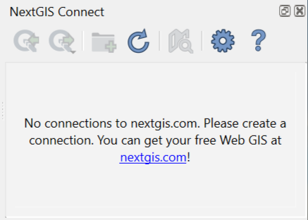
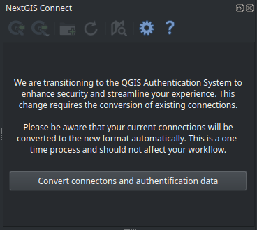
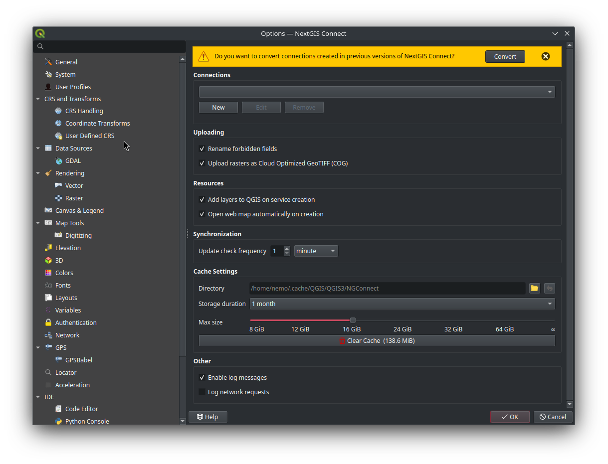
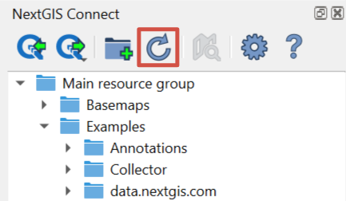
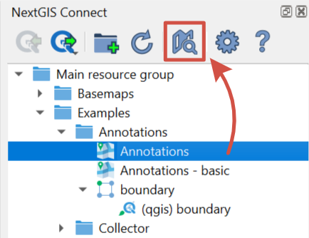
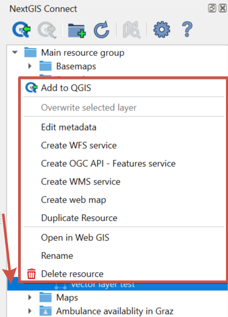
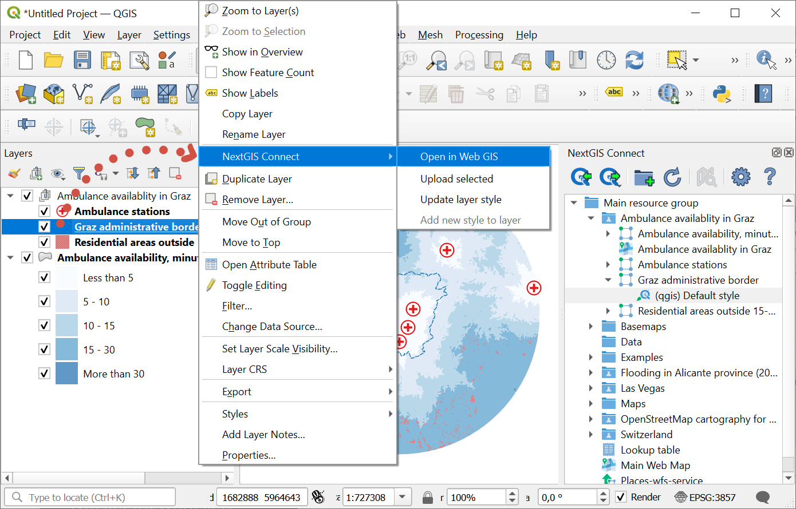

Plugin interface
================

.. figure:: _static/connect_panel_en_2.png
   :align: center
   :alt: NextGIS Connect panel
   :width: 10cm
   
   NextGIS Connect panel

.. |button_to_qgis| image:: _static/button_to_qgis.png
   :width: 6mm

.. |button_to_wg| image:: _static/button_to_wg.png
   :width: 6mm

.. |button_newfolder| image:: _static/button_newfolder.png
   :width: 6mm

.. |button_filter| image:: _static/button_filter.png
   :width: 6mm
   :alt: funnel

.. |button_refresh| image:: _static/button_refresh.png
   :width: 6mm

.. |button_openmap| image:: _static/button_openmap.png
   :width: 6mm
   :alt: map with magnifying glass

.. |button_settings| image:: _static/button_settings.png
   :width: 6mm
   :alt: blue gear

.. |button_help| image:: _static/button_help.png
   :width: 6mm
   :alt: question mark

Buttons on the panel:

* |button_to_qgis| `Add to QGIS <https://docs.nextgis.com/docs_ngconnect/source/resources.html>`_

* |button_to_wg| `Add to Web GIS <https://docs.nextgis.com/docs_ngconnect/source/resources.html#ng-connect-export>`_

* |button_newfolder| `Create resource group <https://docs.nextgis.com/docs_ngconnect/source/manage.html#ng-connect-res-group>`_

* |button_filter| `Search and filter resources <https://docs.nextgis.com/docs_ngconnect/source/filter.html>`_

* |button_refresh| `Refresh resource tree <https://docs.nextgis.com/docs_ngconnect/source/panel.html#connect-refresh>`_

* |button_openmap| `Open Web Map in browser <https://docs.nextgis.com/docs_ngconnect/source/panel.html#connect-open-webmap>`_

* |button_settings| `Plugin settings <https://docs.nextgis.com/docs_ngconnect/source/ngc_settings.html>`_

* |button_help| Help - opens this manual

If no connection is set at the moment, the following message will be shown:

   
   NextGIS Connect panel if there is no connection

If the previously used version of NextGIS Connect didn't support QGIS authentication, after the update you will need to convert all existing connections and authentication data. You can do it in the NextGIS Connect panel or in the `plugin settings <https://docs.nextgis.com/docs_ngconnect/source/ngc_settings.html>`_.

   Message announcing the need to convert connections

   Message announcing the need to convert connections in NextGIS Connect settings

.. _connect_refresh:

Refresh
----------

Click |button_refresh| to refresh the entire Web GIS resource tree so that it's up to date with the current state of the server.

   Refreshing Web GIS data

.. _connect_open_webmap:

Display in browser
-----------------------------

If a Web Map (|resource_webmap| NGW Web Map), a layer or a style is selected in NextGIS Connect resource tree, click |button_openmap| to preview the resource in a new tab of the default browser.

   Opening a Web Map

Context menu also allows to display a Web Map, layer or style in browser or to `open the Web GIS page of any resource <https://docs.nextgis.com/docs_ngconnect/source/panel.html#ng-connect-cont-menu>`_.

.. _ng_connect_cont_menu:

Context Menu
----------------

Context menu may differ depending on resource type.  

   
   Context menu example

Common options for all resource types:

- Open in WebGIS – open the page of the selected resource in Web GIS, also can be donde from the Layers panel, see :numref:`ngc_open_from_layertree_pic`;

- Rename resource;

- `Delete resource <https://docs.nextgis.com/docs_ngconnect/source/manage.html#connect-resource-delete>`_;

- Edit metadata.

Variable options – depend on resource type:

- Add to QGIS - `see above <https://docs.nextgis.com/docs_ngconnect/source/resources.html#ng-connect-export>`_ for the types of resources that can be added and other details;

- `Create Web Map <https://docs.nextgis.com/docs_ngconnect/source/manage.html#web-map>`_ - available for: Vector layer, Vector style, Raster layer, WMS Layer;

- `Download as QML <https://docs.nextgis.com/docs_ngconnect/source/export.html#connect-save-style>`_ - only available for QGIS Vector style;

- `Copy style <https://docs.nextgis.com/docs_ngconnect/source/edit.html#connect-style-copy>`_ - only available for QGIS Vector style;

- `Create WFS service <https://docs.nextgis.com/docs_ngconnect/source/resources.html#wfs>`_ - only available for Vector layer;

- `Create OGC API - Features service <https://docs.nextgis.com/docs_ngconnect/source/resources.html#ogc-api-features>`_ - only available for Vector layer;

- `Create WMS service <https://docs.nextgis.com/docs_ngconnect/source/resources.html#wms>`_ - only available for Vector layer;

- `Duplicate resource <https://docs.nextgis.com/docs_ngcom/source/ngqgis_connect.html#ngcom-connect-resource-double>`_ - available only for Vector layer and Raster layer;

- `Overwrite selected layer <https://docs.nextgis.com/docs_ngconnect/source/edit.html#connect-data-overwrite>`_ - only available for Vector layer;

- `Display in browser <https://docs.nextgis.com/docs_ngconnect/source/panel.html#connect-open-webmap>`_ - available for Web Map, all types of layers and styles.

The plugin also allows you to navigate to the Web GIS data directly from the the Layers panel in QGIS. In the layer's context menu find "NextGIS Connect" and press "Open in Web GIS".

   Opening Web GIS data from QGIS layer tree

