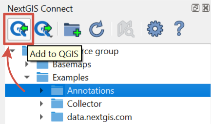
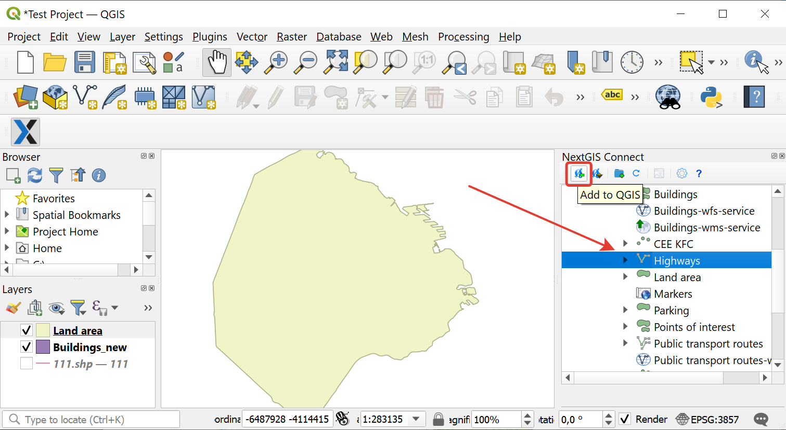
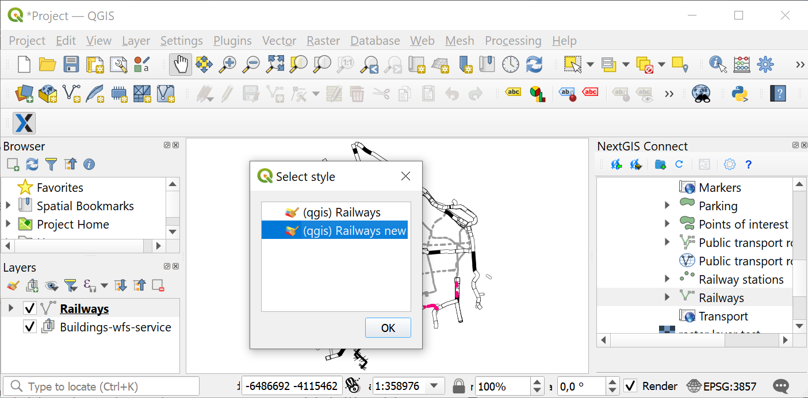
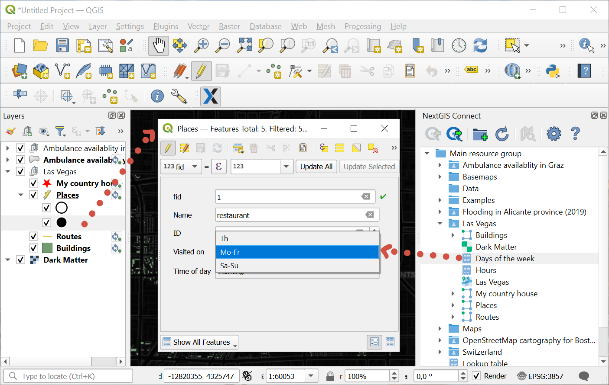
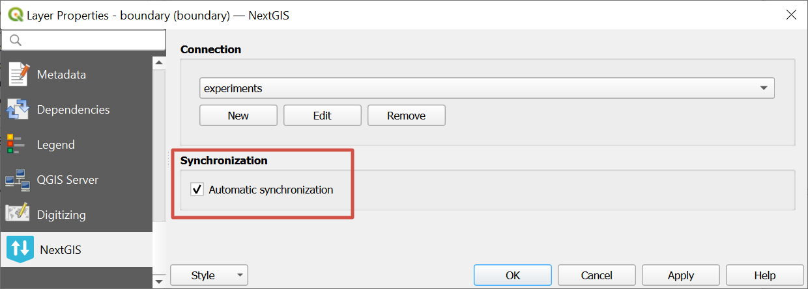

.. _connect_data_upload:

Working with cloud data
====================================

With this plugin you can download data from Web GIS to QGIS to edit it.

.. |button_to_qgis| image:: _static/button_to_qgis.png
   :width: 6mm

.. _ng_connect_export:

From Web GIS to QGIS
------------------------------------

   
   Button for data transfer to QGIS

Option is available if one of the following resources is selected in NextGIS Web resource tree:

.. |resource_vector_point| image:: _static/nextgis_connect/vector_layer_point.png
.. |resource_vector_mpoint| image:: _static/nextgis_connect/vector_layer_mpoint.png
.. |resource_vector_line| image:: _static/nextgis_connect/vector_layer_line.png
.. |resource_vector_mline| image:: _static/nextgis_connect/vector_layer_mline.png
.. |resource_vector_polygon| image:: _static/nextgis_connect/vector_layer_polygon.png
.. |resource_vector_mpolygon| image:: _static/nextgis_connect/vector_layer_mpolygon.png
.. |resource_wfs| image:: _static/symbol_wfs_service.png
   :width: 6mm
.. |resource_wms| image:: _static/symbol_wms_service.png
   :width: 6mm
.. |resource_style| image:: _static/symbol_qgis_vector_style.png
   :width: 6mm
.. |resource_webmap| image:: _static/symbol_webmap.png
   :width: 6mm
.. |resource_group| image:: _static/symbol_resource_group.png
   :width: 6mm
.. |raster_layer| image:: _static/symbol_raster_layer.png
   :width: 6mm
.. |vector_layer| image:: _static/symbol_vector_layer.png
   :width: 6mm
.. |basemap_symbol| image:: _static/symbol_basemap.png
   :width: 6mm
.. |tms_layer_symbol| image:: _static/symbol_tms_layer.png
   :width: 6mm
.. |tms_connection_symbol| image:: _static/symbol_tms_connection.png
   :width: 6mm
.. |postgis_layer_symbol| image:: _static/symbol_postgis_layer.png
   :width: 6mm
.. |demo_project_symbol| image:: _static/symbol_demo_project.png
   :width: 6mm
.. |wms_layer_symbol| image:: _static/symbol_wms_layer.png
   :width: 6mm
.. |wms_connection_symbol| image:: _static/symbol_wms_connection.png
   :width: 6mm
.. |wfs_layer_symbol| image:: _static/symbol_wfs_layer.png
   :width: 6mm

- |vector_layer| Vector layer (NGW Vector Layer) - GeoJSON vector layer will be created in QGIS; 
- |wfs_layer_symbol| WFS Layer - a WFS layer will be created in QGIS;
-  |resource_wfs| WFS service (NGW WFS Service) - WFS layer will be created in QGIS; 
- |wms_layer_symbol| WMS Layer - the selected WMS layer will be added to QGIS;
- |resource_wms| WMS Service - a WMS layer will be created in QGIS, the data source for which the selected WMS Service will be;
- |wms_connection_symbol| WMS Connection - you can select the WMS layer from the list to add to QGIS;
- |tms_layer_symbol| TMS layer;
- |tms_connection_symbol| TMS connection;
- |postgis_layer_symbol| PostGIS layer;
-  |resource_style| QGIS Vector Layer style - if it's a style of a vector layer, a GeoJSON vector layer with the identical style will be created in QGIS; if it's a style of a WFS layer, a WFS with that style will be created;
- |raster_layer| Raster layer - a GeoTIFF raster layer will be created in QGIS;
- |basemap_symbol| Basemap;
- |resource_webmap| Web Map - a QGIS project will be created containing layers, styles and basemaps. A mutually exclusive group will be created for all the basemap layers.
- |demo_project_symbol| `Demo Project <https://docs.nextgis.com/docs_ngcom/source/demoprojects.html>`_ - a QGIS project will be created, containing layers, styles and basemaps;
- |resource_group| Resource group - the group and resources inside it will be added to the QGIS project.

Detailed instructions for adding various data types to QGIS `here <https://docs.nextgis.com/docs_ngconnect/source/resources.html#connect-data-export>`_.

Vector layers added from Web GIS can be `edited in QGIS <https://docs.nextgis.com/docs_ngconnect/source/edit.html#>`_ right away.

.. _connect_data_export:

Add vector layer to QGIS
---------------------------------------

NextGIS Connect plugin enables a fast export of vector data from Web GIS to QGIS for further processing, analysis, saving in different formats and other data operations.

It’s possible due to the option of fast creation of GeoJSON vector layers in QGIS using vector data from Web GIS:

* Select in NextGIS Connect Resources panel Vector layer which you want to export to QGIS;
Press **Add to QGIS** button on NextGIS Connect control panel or select **Add to QGIS** in the layer context menu;

   
   Exporting vector layer from Web GIS

* If the layer has multiple QGIS styles, there are several options depending on what you select in the Connect window:

1. If you select a layer with **multiple styles** in the Connect window, all the styles will be added, but you need to chose current style in a dialog window. Double-click the style to select it. This is the only case in which a dialog pops up.

   
   Selecting QGIS style for export

2. If you select a **style** in the Connect window, all the styles of the layer will be added, with the selected style chosen as current style.

3. If you select a **resource group** containing layers with multiple styles, all the styles will be added. The style used as current will be the one with the same name as the layer or the first in alphabetical order. No dialog will be displayed.

4. If you add WFS/OGCF, no dialog will be displayed. The style with the same name as the layer or the first in alphabetical order will be chosen.

You can change current style in the layer properties.

If the layer is exported successfully you'll see in QGIS Layers panel a new GeoJSON vector layer which you can use in your projects or save to your device in a required format. 

.. warning::

    **Photos** made via NextGIS Collector/Mobile apps and uploaded to Web GIS as attachments to layers **wouldn't be available** in desktop NextGIS QGIS after downloading these layers through NextGIS Connect plugin.

.. _ng_connect_lookup:

Lookup tables
------------------------------------------------

In Web GIS you can create `Lookup tables <https://docs.nextgis.com/docs_ngweb/source/create_other.html#ngcom-lookup-table-for-layer>`_ and link them to vector layers.

When the layer is exported from Web GIS to QGIS the values of the lookup table will be added to the layer using value map widget. After that they will be available in the desktop app in the corresponding field of the table when you enter edit mode.

   Lookup table values available during editing in QGIS

In QGIS you can use Value relation widget to add another vector layer as a lookup table or upload a CSV file. When the layer is transfered to Web GIS, a Lookup table resource will be created for it.

.. _connect_data_sync:

Synchronization with Web GIS
-----------------------------

Layer added to QGIS continues to be synced with the Web GIS server. It means that all the changes made via Web interface will be displayed in the desktop app and the edits made in QGIS `change the layer in the Web GIS <https://docs.nextgis.com/docs_ngconnect/source/edit.html>`_.

Synchronization is automatic. Set how often Connect checks for layer updates in `QGIS Options <https://docs.nextgis.com/docs_ngconnect/source/ngc_settings.html#ngc-set-sync>`_.

You can disable auto sync for a layer and synchronize it manually when needed. Go to layer properties and untick "Automatic synchronization".

   Automatic synchronization is enabled

To start the synchronization manually, open the `layer status window <https://docs.nextgis.ru/docs_ngconnect/source/edit.html>`_ and press **Synchronization**.

.. _ng_connect_share_project:

Open a project created on another device
-------------------------------------------------

With NextGIS Connect v. 3.2.0 and up a project file that uses detached layers can be opened on another computer if they both have a connection to the same Web GIS. When the project is opened, the layers are loaded automatically.

#. In NextGIS Connect check the connection to the Web GIS or create it, if necessary. 
#. Add the layers from Web GIS to QGIS project.
#. Save the project.
#. Copy the project file and transfer it to the other computer.
#. On the other computer in NextGIS Connect check the connection to the same Web GIS or create it if necessary.
#. Open the project.

The data will be loaded from the Web GIS. To check if the synchronization was successful, click on the layer status icon next to its name.

.. note:: Open the project **after** the connection is set up. If you get "Handle Unavailable Layers" window, close the project, check the connection to Web GIS, then re-open the project.
