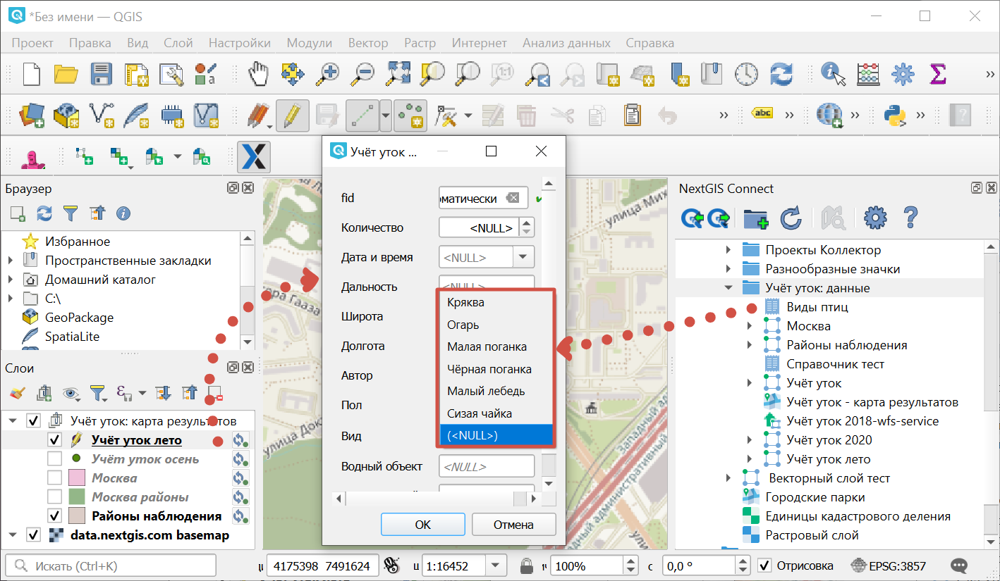
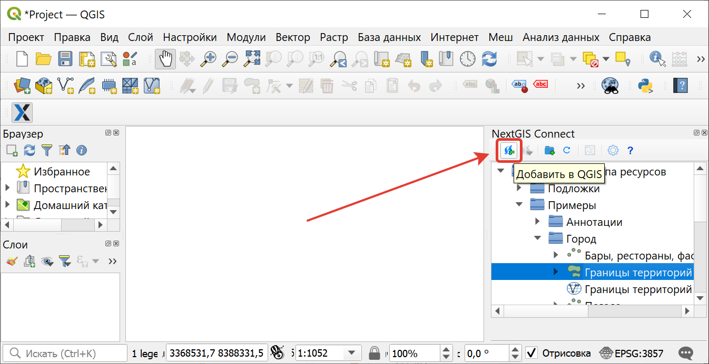
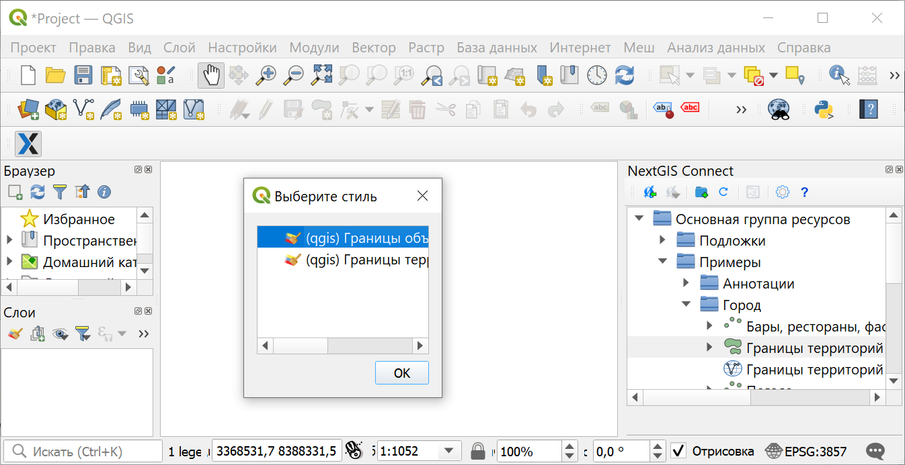
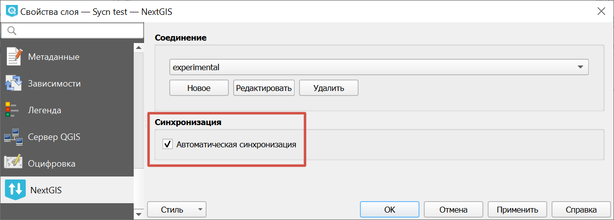

.. _connect_data_upload:

Создание ресурсов и загрузка данных
====================================

Модуль NextGIS Connect позволяет быстро загружать в Веб ГИС растровые и векторные данные, а также `целиком проекты QGIS <https://docs.nextgis.ru/docs_ngconnect/source/resources.html#qgis-project>`_. Это позволит вам легко опубликовать в интернете свои карты и геоданные.

Также при помощи модуля вы можете `добавлять ресурсы из Веб ГИС <https://docs.nextgis.ru/docs_ngconnect/source/resources.html#connect-data-export>`_ в QGIS, чтобы редактировать их в настольном приложении.

.. _ng_connect_lookup:

Загрузка справочников
------------------------------------------------

В Веб ГИС можно создавать `справочники <https://docs.nextgis.ru/docs_ngweb/source/create_other.html#ngw-create-lookup-table>`_ и подключать их к векторным слоям.

При экспорте слоя из Веб ГИС в QGIS значения справочника будут добавлены в слой как Карта значений (виджет value map). После этого в настольном приложении в режиме редактирования они будут доступны для выбора в соответствующем поле таблицы.

   Значения из справочника доступны при редактировании слоя в QGIS

В QGIS, в свою очередь, вы можете при помощи виджета Связанное значение (value relation) использовать в качестве справочника векторный слой или загрузить CSV-файл. При отправке слоя с геометриями в облако в Веб ГИС будет создан ресурс справочника.

.. _connect_data_export:

Выгрузка данных из Веб ГИС в QGIS
---------------------------------------

Модуль NextGIS Connect позволяет быстро экспортировать векторные данные из Веб ГИС в QGIS для их последующей обработки, анализа, выгрузки и иных операций.

Для этого в модуле доступна операция быстрого создания векторных слоев GeoJSON в QGIS с использованием данных Векторных слоев Веб ГИС:

* Выберите в дереве ресурсов Веб ГИС в окне модуля NextGIS Connect Векторный слой, который вы хотите экспортировать в QGIS;
* Нажмите кнопку **Добавить в QGIS** на панели инструментов модуля или выберите пункт **Добавить в QGIS** в контекстном меню слоя;

   
   Экспорт векторного слоя из Веб ГИС

* В случае, если слой имеет несколько стилей QGIS, сценарий зависит от того, что выделено для загрузки в окне Connect:

1. При выборе в дереве Connect **слоя с несколькими стилями**, они подгрузятся все, но будет предложено выбрать текущий. Это единственный вариант, при котором появляется диалоговое окно. Кликните дважды на нужном стиле, чтобы выбрать его.

   
   Выбор текущего QGIS-стиля

2. При выборе в дереве Connect **стиля** слоя, добавятся все стили, по умолчанию будет выбранный.

3. При добавлении **группы ресурсов**, которая содержит слои с несколькими стилями, будут добавлены все стили и выбран либо одноименный слою, либо первый по алфавиту. Диалог с выбором показан не будет.

4. При добавлении WFS/OGCF диалога выбора не будет. Стиль будет выбран либо одноименный слою, либо первый по алфавиту.

Выбрать другой стиль для загруженного слоя можно будет в свойствах слоя.

Если слой экспортировался успешно, то в панели слоев QGIS появится новый векторный слой GeoJSON, который можно использовать в текущих проектах или сохранить на устройство в нужном формате.

.. _connect_data_sync:

Синхронизация с Веб ГИС
------------------------

После загрузки в QGIS слой продолжает синхронизироваться с сервером Веб ГИС. Это значит, что изменения, внесённые в слой, будут отражаться и в настольном приложении, и наоборот, редактирование слоя в QGIS `приведёт к изменениям в облаке <https://docs.nextgis.ru/docs_ngconnect/source/edit.html>`_.

Синхронизация совершается автоматически. Настроить, как часто это происходит, можно в `Параметрах QGIS <https://docs.nextgis.ru/docs_ngconnect/source/ngc_settings.html#ngc-set-sync>`_.

Также для отдельного слоя можно отключить автоматическую синхронизацию и запускать её только вручную. Для этого в свойствах слоя в разделе NextGIS снимите галочку "Автоматическая синхронизация".

   Автоматическая синхронизация включена

Чтобы запустить синхронизацию вручную, откройте `окно Статуса слоя <https://docs.nextgis.ru/docs_ngconnect/source/edit.html>`_ и нажмите кнопку **Синхронизация**.
