.. _connect_data_upload:

Использование данных из хранилища
====================================

При помощи модуля вы можете добавлять ресурсы из Веб ГИС в QGIS, чтобы редактировать их в настольном приложении.

.. |button_to_qgis| image:: _static/button_to_qgis.png
   :width: 6mm

.. _ng_connect_export:

Добавление данных из Веб ГИС в QGIS
------------------------------------

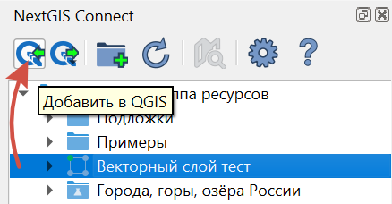
   
   Кнопка экспорта данных в QGIS

Операция доступна, если в дереве ресурсов NextGIS выбран один из следующих видов ресурсов:

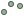
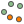
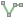
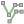
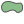
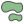
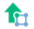

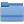

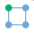

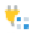
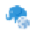
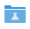

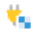

- |vector_layer| Векторный слой (NGW Vector Layer)  - в QGIS будет создан векторный слой GeoJSON;
- |wfs_layer_symbol| WFS Слой - в QGIS будет создан WFS слой;
- |resource_wfs| WFS Сервис (NGW WFS Service) - в QGIS будет создан WFS слой, источником данных для которого будет выбранный WFS Сервис;
- |wms_layer_symbol| WMS Слой - в QGIS будет добавлен выбранный WMS слой;
- |resource_wms| WMS Сервис - в QGIS будет создан WMS слой, источником данных для которого будет выбранный WMS Сервис;
- |wms_connection_symbol| WMS Соединение - из списка можно будет выбрать WMS слой, который необходимо добавить в QGIS
- |tms_service_symbol| TMS Слой;
- |tms_connection_symbol| TMS Соединение;
- |postgis_layer_symbol| PostGIS Слой;
- |resource_style| QGIS Стиль Векторного слоя - если стиль относится к векторному слою, в QGIS будет создан векторный слой GeoJSON, со стилем идентичным выбранному стилю; если стиль относится к слою WFS, будет создан слой WFS с таким стилем;
- |raster_layer| Растровый слой - в QGIS будет создан растровый слой GeoTIFF;
- |basemap_symbol| Подложка;
- |resource_webmap| Веб-карта - при добавлении в QGIS она будет представлена в виде проекта со слоями, стилями и подложками. Подложки карты будут объединены во взаимоисключающую группу;
- |demo_project_symbol| `Демо-проект <https://docs.nextgis.ru/docs_ngcom/source/demoprojects.html>`_ - в QGIS будет создан проект, содержащий слои, стили и подложки;
- |resource_group| Группа ресурсов - в текущий проект QGIS будет добавлена новая группа и входящие в неё ресурсы.

Алгоритм загрузки разных типов данных в QGIS подробно описан `здесь <https://docs.nextgis.ru/docs_ngconnect/source/resources.html#connect-data-export>`__.

Векторные слои из вашей Веб ГИС можно `редактировать <https://docs.nextgis.ru/docs_ngconnect/source/edit.html#>`_ сразу после добавления их в QGIS.

.. _connect_data_export:

Добавление слоя
---------------------------------------

Модуль NextGIS Connect позволяет быстро добавлять векторные данные из Веб ГИС в QGIS для их последующей обработки, анализа, выгрузки и иных операций.

* Выберите в дереве ресурсов Веб ГИС в окне модуля NextGIS Connect Векторный слой, который вы хотите добавить в QGIS;
* Нажмите кнопку |button_to_qgis| **Добавить в QGIS** на панели инструментов модуля или выберите пункт **Добавить в QGIS** в контекстном меню слоя;

.. figure:: _static/NGConnect_export_select_ru.png
   :name: NGConnect_export_select_pic
   :align: center
   :width: 20cm
   
   Экспорт векторного слоя из Веб ГИС

* В случае, если слой имеет несколько стилей QGIS, сценарий зависит от того, что выделено для загрузки в окне Connect:

1. При выборе в дереве Connect **слоя с несколькими стилями**, они подгрузятся все, но будет предложено выбрать текущий. Это единственный вариант, при котором появляется диалоговое окно. Кликните дважды на нужном стиле, чтобы выбрать его.

.. figure:: _static/NGConnect_export_select_style_ru.png
   :name: NGConnect_export_select_style_pic
   :align: center
   :width: 20cm
   
   Выбор текущего QGIS-стиля

2. При выборе в дереве Connect **стиля** слоя, добавятся все стили, по умолчанию будет выбранный.

3. При добавлении **группы ресурсов**, которая содержит слои с несколькими стилями, будут добавлены все стили и выбран либо одноименный слою, либо первый по алфавиту. Диалог с выбором показан не будет.

4. При добавлении WFS/OGCF диалога выбора не будет. Стиль будет выбран либо одноименный слою, либо первый по алфавиту.

Выбрать другой стиль для загруженного слоя можно будет в свойствах слоя.

Процесс добавления слоя с несколькими стилями в видео:

.. raw:: html

   <iframe width="560" height="315" src="https://rutube.ru/play/embed/d65766eacd8a3f162fff6ce09556045b/" frameBorder="0" allow="clipboard-write; autoplay" webkitAllowFullScreen mozallowfullscreen allowFullScreen></iframe>

Смотреть на `youtube <https://youtu.be/snq2yv8iNEk>`__, `rutube <https://rutube.ru/video/d65766eacd8a3f162fff6ce09556045b/>`__.

Если слой экспортировался успешно, то в панели слоев QGIS появится новый векторный слой GeoJSON, который можно использовать в текущих проектах или сохранить на устройство в нужном формате.

.. warning::

   Стоит обратить внимание на то, что **фотографии**, которые были собраны в мобильных приложениях NextGIS Collector/Mobile и загружены в Веб ГИС вместе со слоями в виде вложений, **не будут** доступны в настольной NextGIS QGIS после загрузки этих слоев через модуль NextGIS Connect!

.. _ng_connect_lookup:

Загрузка справочников
------------------------------------------------

В Веб ГИС можно создавать `справочники <https://docs.nextgis.ru/docs_ngweb/source/create_other.html#ngw-create-lookup-table>`_ и подключать их к векторным слоям.

При экспорте слоя из Веб ГИС в QGIS значения справочника будут добавлены в слой как Карта значений (виджет value map). После этого в настольном приложении в режиме редактирования они будут доступны для выбора в соответствующем поле таблицы.

.. figure:: _static/nextgis_connect/ngc_lookup_ru.png
   :align: center
   :width: 20cm

   Значения из справочника доступны при редактировании слоя в QGIS

В QGIS, в свою очередь, вы можете при помощи виджета Связанное значение (value relation) использовать в качестве справочника векторный слой или загрузить CSV-файл. При отправке слоя с геометриями в облако в Веб ГИС будет создан ресурс справочника.

.. _connect_data_sync:

Синхронизация с Веб ГИС
------------------------

После загрузки в QGIS слой продолжает синхронизироваться с сервером Веб ГИС. Это значит, что изменения, внесённые в слой, будут отражаться и в настольном приложении, и наоборот, редактирование слоя в QGIS `приведёт к изменениям в облаке <https://docs.nextgis.ru/docs_ngconnect/source/edit.html>`_.

Синхронизация совершается автоматически. Настроить, как часто это происходит, можно в `Параметрах QGIS <https://docs.nextgis.ru/docs_ngconnect/source/ngc_settings.html#ngc-set-sync>`_.

Также для отдельного слоя можно отключить автоматическую синхронизацию и запускать её только вручную. Для этого в свойствах слоя в разделе NextGIS снимите галочку "Автоматическая синхронизация".

.. figure:: _static/ngc_layer_autosync_set_ru.png
   :name: ngc_layer_autosync_set_pic
   :align: center
   :width: 20cm

   Автоматическая синхронизация включена

Чтобы запустить синхронизацию вручную, откройте `окно Статуса слоя <https://docs.nextgis.ru/docs_ngconnect/source/edit.html>`_ и нажмите кнопку **Синхронизация**.

.. _ng_connect_share_project:

Открытие проекта, созданного на другой машине
-------------------------------------------------

Начиная с версии модуля 3.2.0 если на двух компьютерах настроено подключение к одной Веб ГИС, можно передавать проекты, использующие откреплённые слои. При открытии данные сами подтянутся.

#. В NextGIS Connect проверьте наличие подключения к Веб ГИС и при необходимости создайте его. 
#. Добавьте нужные слои из Веб ГИС в проект QGIS.
#. Сохраните проект.
#. Скопируйте файл проекта и перенесите его на второе устройство.
#. На втором устройстве в NextGIS Connect проверьте наличие подключения к той же Веб ГИС и при необходимости создайте его.
#. Откройте проект.

Данные будут подгружены. Чтобы проверить успешность синхронизации, нажмите на значок статуса слоя рядом с его названием.

.. note:: Открывайте проект **после** того, как установили подключение. Если возникает ошибка "Недостающие слои", закройте проект, проверьте подключение к Веб ГИС и откройте проект снова.

