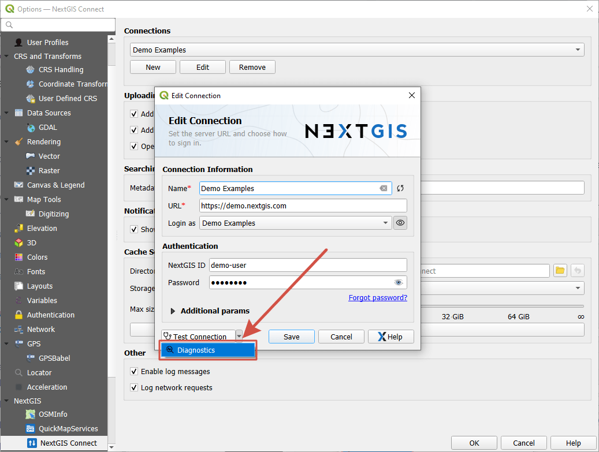
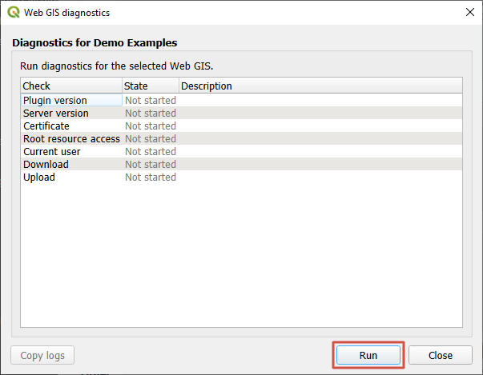
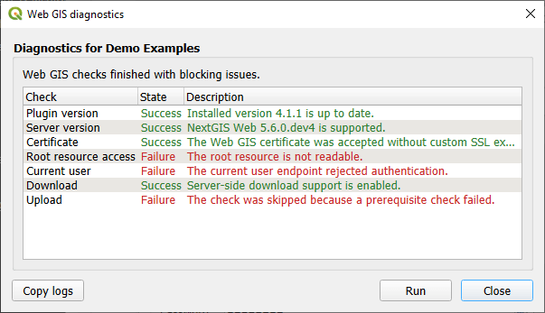

   
Troubleshooting
===============

If you encounter any issues while working with the plugin, please use the basic checks described below.

.. _diagnostics:

Diagnostics
------------

NextGIS Connect plugin has a built-in diagnostics systhem. 

Open Settings by clicking on the blue gear |button_settings| in the plugin panel. 

In the opened window click **Edit** in the Connections section. In the connection parameters click on the downward arrow next to the "Test connection" button and select **Diagnostics**.

   Opening the Diagnostics window

In the opened window click **Run**.

   Starting diagnostics

Diagnostics help you determine if there are any issues with the connection. For example, if you see the message "The root resource is not available", it means that the user credentials are incorrect or this user does not have permissions to view the Web GIS. 

   Diagnostic result if user credentials are incorrect

Also you can click **Copy logs**, it copies the entire diagnostics log to your clipboard. This is useful information you can send to our support team.

.. _ng_connect_ngw_issues:

Problems connecting to Web GIS (NextGIS Web)
--------------------------------------------

.. _checkqgis:

Check QGIS version
~~~~~~~~~~~~~~~~~~

Update software if updates are available. Using our `NextGIS QGIS <https://nextgis.com/nextgis-qgis/>`_ follow:

* Check version: Help > About
* Check updates: Help > Check QGIS version
* Restart QGIS after update

.. _checkconnect:

Check NextGIS Connect version
~~~~~~~~~~~~~~~~~~~~~~~~~~~~~

To work, it is recommended to use the latest version of the plugin. You can check and update it as follows:

* Top Menu > Plugins > Manage and install plugins
* If the version is outdated, there will be a message at the top saying that there is an update for the plugin, and an update button will be available in the lower right corner of the window

There are no more updates for QGIS 2.X since NextGIS Connect 0.14.0. Minimum QGIS version is 3.X now.

.. _credentials:

Check user credentials
~~~~~~~~~~~~~~~~~~~~~~

.. note:: If you forgot your password or never set one, use `this instruction <https://docs.nextgis.com/docs_ngcom/source/faq_webgis.html#ngcom-change-passwords-webgis>`_.

Open plugin settings |button_settings|.

In the Connections section click **Edit** to open the `parameters of the current NextGIS Web connection <https://docs.nextgis.com/docs_ngconnect/source/ngc_install.html#create-connection-pic>`_.

Make sure that all fields are filled in correctly. The URL format is ``https://demo.nextgis.com``, there shouldn't be any more symbols after ``com``.

In the Authentication section check the `user credentials <https://docs.nextgis.com/docs_ngconnect/source/ngc_install.html#auth-config-create-pic>`_.

* Login - email address you used to create NextGIS ID or username of Web GIS user;
* Password - try entering it again to make sure there are no typos.

After checking the credentials click **Test connection**. If the link and user details are correct, you'll get a green success message.

.. _corp:

For corporate network
~~~~~~~~~~~~~~~~~~~~~~~

If you work in the internal corporate network, set up the `settings of your proxy <https://docs.nextgis.com/docs_ngqgis/source/settings.html#ngq-set-network>`_ (Settings> Options> Network)

.. _limit:

Issues uploading data
----------------------

Cannot overwrite a layer
~~~~~~~~~~~~~~~~~~~~~~~~~

Error message: "Not implemented for feature versioning. This operation cannot be performed on a resource with feature versioning enabled. Disable feature versioning for the resource first, and then try again".

This means you're using an outdated version of NextGIS Connect. Please upgrade in Plugins - Manage and install plugins.

Maximum number of resources reached
~~~~~~~~~~~~~~~~~~~~~~~~~~~~~~~~~~~

Error "Maximum number of resources reached" can occur if your Web GIS is on Free plan and the number of layers is limited to 15. To upload more layers, `switch to Premium <https://my.nextgis.com/subscription/>`_ in your NextGIS ID account.

.. |button_settings| image:: _static/button_settings.png
   :width: 6mm