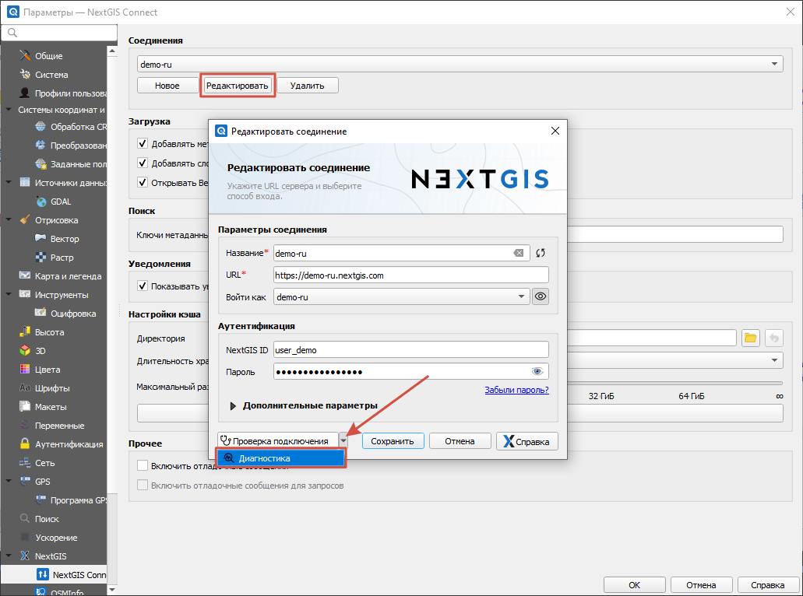
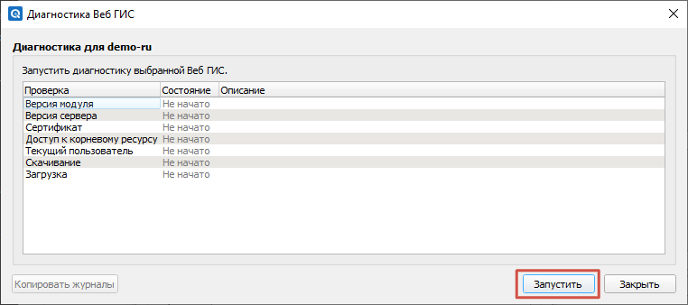
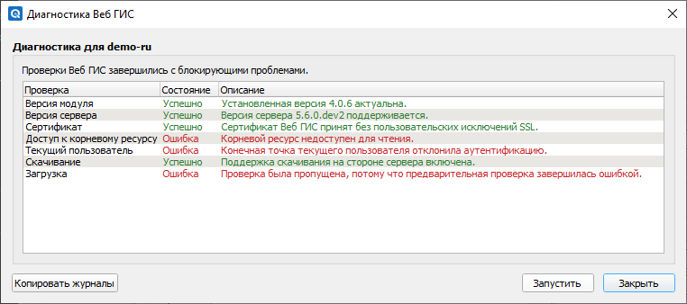

    
Чеклист работоспособности и решение проблем
===========================================

Если вы столкнулись с какими-либо трудностями при работе с модулем, воспользуйтесь основными проверками, описанными ниже.

.. _diagnostics:

Диагностика
------------

В модуле есть встроенная функция диагностики соединения. 

Вызовите настройки, нажав на шестерёнку |button_settings| в панели модуля NextGIS Connect. 

В открывшемся окне в разделе "Соединения" нажмите **Редактировать**. В окне параметров соединения нажмите на стрелку вниз рядом с кнопкой "Проверка подключеня" и выберите "Диагностика".

   Открытие окна диагностики

В открывшемся окне нажмите **Запустить**.

   Запуск диагностики

В результате диагностики вы можете обнаружить, есть ли проблемы с подключением. Например, если вы видите сообщение "Корневой ресурс не доступен для чтения", это говорит о том, что введены неправильные данные пользователя или у этого пользователя нет прав на просмотр Веб ГИС. 

   Результат диагностики при неверных данных пользователя

Также вы можете нажать **Копировать журналы**, это скопирует полный журнал диагностики в буфер обмена. Эти данные можно отправить в техническую поддержку.

.. _ng_connect_ngw_issues:

Не удаётся подключиться к Веб ГИС (NextGIS Web)
------------------------------------------------

.. _checkqgis:

Проверьте версию QGIS
~~~~~~~~~~~~~~~~~~~~~

Обновите версию при наличии обновлений. Если вы используете нашу сборку `NextGIS QGIS <http://nextgis.ru/nextgis-qgis/>`_:

* Посмотреть версию: Справка > О программе
* Проверить обновления: Справка > Проверить версию QGIS
* После обновления перезапустите программу

Версии NextGIS QGIS на базе QGIS 2.х больше не поддерживаются. Если у вас такая - нужно обновиться через полное удаление и установку заново текущей версии.

.. _checkconnect:

Проверьте версию NextGIS Connect
~~~~~~~~~~~~~~~~~~~~~~~~~~~~~~~~

Для работы рекомендуется использовать последнюю версию модуля в любой момент времени. Проверить и обновить её можно можно следующим образом:

* Верхнее меню > Модули > Управление модулями
* Если версия старая, наверху будет сообщение о наличии обновления для модуля, а в правом нижнем углу окна будет доступна кнопка его обновления

Необходимо, чтобы версия NextGIS Connect была актуальной.

.. _credentials:

Проверьте данные подключения и пользователя
~~~~~~~~~~~~~~~~~~~~~~~~~~~~~~~~~~~~~~~~~~~

.. note:: Если вы забыли или никогда не задавали пароль, инструкции по восстановлению `здесь <https://docs.nextgis.ru/docs_ngcom/source/faq_webgis.html#ngcom-change-passwords-webgis>`_.

Откройте настройки модуля. 

В разделе "Соединения" нажмите "Редактировать", откроются `настройки текущего подключения к Веб ГИС <https://docs.nextgis.ru/docs_ngconnect/source/ngc_install.html#create-connection-pic>`_.

Проверьте правильность параметров соединения. Формат URL - ``https://demo.nextgis.com`` после .com не должно быть ничего. 

В разделе Аутентификация проверьте `данные пользователя <https://docs.nextgis.ru/docs_ngconnect/source/ngc_install.html#auth-config-create-pic>`_, для этого нажмите на значок карандаша.

* Логин - адрес электронной почты, который вы использовали при создании NextGIS ID или имя пользователя Веб ГИС;
* Пароль - можете ввести его заново, чтобы убедиться, что включен нужный язык.

После этого нажмите **Сохранить**, вернитесь в настройки соединения и нажмите **Проверка подключения**.

.. _corp:

Для корпоративной сети
~~~~~~~~~~~~~~~~~~~~~~~

Если вы работаете во внутренней корпоративной сети, то пропишите `настройки вашего прокси <https://docs.nextgis.ru/docs_ngqgis/source/settings.html#ngq-set-network>`_ (Настройки > Параметры > Cеть)

.. _data_upload:

Не загружаются данные
---------------------------

.. _overwrite:

Не удаётся перезаписать слой
~~~~~~~~~~~~~~~~~~~~~~~~~~~~~

Ошибка: "Не реализовано для версионирования объектов. Операция не может быть выполнена для ресурса с включенным версионированием объектов. Отключите версионирование и повторите попытку."

.. note:: Если у вас возникает эта ошибка, вы пользуетесь старой версией NextGIS Connect. Обновите модуль до актуальной версии.

В версиях модуля до 4.0.0 слой, для которого включено версионирование, нельзя перезаписать новыми данными. Выключить версионирование можно `в настройках слоя в Веб ГИС <https://docs.nextgis.ru/docs_ngweb/source/layers_settings.html#create-vector-layer-vers-pic>`_.

Если вы собираетесь регулярно редактировать слой в QGIS, рекомендуем после перезаписи включить версионирование снова и `добавить слой в QGIS через NextGIS Connect <https://docs.nextgis.ru/docs_ngconnect/source/resources.html#connect-data-export>`_. Это позволит автоматически `синхронизировать <https://docs.nextgis.ru/docs_ngconnect/source/edit.html>`_ внесённые в QGIS изменения с сервером.

.. _rasters:

Не грузятся растры
~~~~~~~~~~~~~~~~~~

Если не грузятся растры, то проверьте, что в `настройках модуля <https://docs.nextgis.ru/docs_ngconnect/source/ngc_settings.html>`_ включена галка  “Загружать растры как Cloud Optimized GeoTIFF”.

.. _limit:

Превышено максимальное количество ресурсов
~~~~~~~~~~~~~~~~~~~~~~~~~~~~~~~~~~~~~~~~~~

Ошибка "Превышено максимальное количество ресурсов" может возникнуть, если Веб ГИС находится на плане Free, он позволяет создать до 15 слоёв. Чтобы загрузить больше слоёв, `подключите подписку Premium в личном кабинете <https://my.nextgis.com/subscription/>`_.

.. |button_settings| image:: _static/button_settings.png
   :width: 6mm
